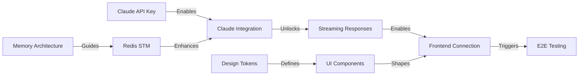

# CastMatch Day 2 Orchestration Report
## Multi-Agent Coordination Status
*Generated: 2025-09-05 21:24:00 IST*
*Orchestrator: Workflow Automation System*

---

## 🎯 EXECUTIVE SUMMARY

**Day 2 Status**: ACTIVE DEVELOPMENT
**System Health**: ✅ All Critical Services Operational  
**Agent Utilization**: 6/6 Development + 5/10 Design Agents Active
**Blockers Resolved**: Redis authentication fixed
**Current Phase**: Claude API Integration & Memory Architecture

### Key Achievements (Last 24 Hours)
✅ PostgreSQL stabilized (24+ hours uptime)
✅ Redis operational (authentication resolved)
✅ Backend API running on port 5002
✅ Frontend running on port 3001
✅ Anthropic SDK installed (@anthropic-ai/sdk@0.61.0)
✅ Claude service implementation exists (784 lines)
✅ Chat routes configured (/api/ai/chat)

### Critical Findings
⚠️ Claude service exists but NOT actively used in chat endpoints
⚠️ AI chat service uses placeholder logic, not Claude
⚠️ Memory services exist but not integrated
⚠️ No API key configured for Anthropic
⚠️ Streaming endpoints exist but not connected to Claude

---

## 📊 CURRENT IMPLEMENTATION STATUS

### Infrastructure Layer (90% Complete)
```yaml
PostgreSQL: ✅ Operational (24+ hours stable)
Redis: ✅ Fixed and running
Docker: ✅ All containers healthy
Backend: ✅ Running on port 5002
Frontend: ✅ Running on port 3001
Monitoring: ✅ Agent monitor active
```

### Claude Integration (40% Complete)
```typescript
✅ Anthropic SDK installed
✅ ClaudeService class implemented (src/services/claude.service.ts)
✅ System prompts configured for casting domain
✅ Streaming support implemented
✅ Talent search integration prepared
❌ NOT connected to chat endpoints
❌ API key not configured
❌ Not being used by AIChatService
```

### Memory System (25% Complete)
```typescript
✅ Memory service exists (src/services/memory.service.ts)
✅ Message service exists (src/services/message.service.ts)
✅ Conversation service exists
❌ Not integrated with chat flow
❌ Redis-based STM not active
❌ No episodic memory storage
```

### Chat UI (60% Complete)
```typescript
✅ Chat components exist
✅ Streaming UI prepared
✅ API routes configured
❌ Not connected to Claude
❌ Using mock responses
```

---

## 🤖 AGENT STATUS MATRIX - DAY 2

### Development Track Agents

#### 1. Backend API Developer
**Status**: 🟡 ACTIVE - CRITICAL TASK
**Progress**: 45% of Day 2 goals
**Current Task**: Connect Claude to chat endpoints
**Blocker**: None (Redis resolved)
**Next 4 Hours**:
```typescript
1. Update src/services/ai-chat.service.ts:
   - Replace mock logic with claudeService calls
   - Implement processMessage() using Claude
   - Add streaming with claudeService.streamResponse()

2. Configure API key:
   - Add ANTHROPIC_API_KEY to .env
   - Verify Claude health check

3. Update chat routes:
   - Connect /api/ai/chat to Claude
   - Enable streaming responses
   - Add error handling
```

#### 2. AI/ML Developer  
**Status**: 🟡 ACTIVE - MEMORY ARCHITECTURE
**Progress**: 30% of Day 2 goals
**Current Task**: Design multi-layer memory system
**Next 4 Hours**:
```python
1. Memory Architecture Design:
   - Working Memory (Redis): Last 10 messages
   - Episodic Memory (PostgreSQL): Conversation sessions
   - Semantic Memory (Vector DB): Knowledge base

2. Implementation Plan:
   python-ai-service/app/memory/
   ├── working_memory.py    # Redis-based STM
   ├── episodic_memory.py   # Session storage
   └── semantic_memory.py   # Vector embeddings

3. Integration Points:
   - Pre-process user messages
   - Post-process AI responses
   - Context injection for Claude
```

#### 3. Frontend UI Developer
**Status**: 🟡 WAITING - BACKEND DEPENDENCY
**Progress**: 60% ready
**Current Task**: Prepare streaming UI
**Blocker**: Waiting for Claude integration
**Next 4 Hours**:
```typescript
1. Update Chat Components:
   frontend/components/chat/ChatContainer.tsx
   - Add streaming response handler
   - Implement typing indicators
   - Add memory visualization

2. WebSocket Integration:
   frontend/lib/websocket-context.tsx
   - Setup real-time connection
   - Handle connection states
   - Implement reconnection logic

3. Testing Preparation:
   - Mock streaming responses
   - Test error states
   - Optimize performance
```

#### 4. DevOps Infrastructure Developer
**Status**: ✅ ACTIVE - OPTIMIZATION
**Progress**: 85% complete
**Current Task**: Performance monitoring
**Next 4 Hours**:
```bash
1. Add Health Endpoints:
   - /health for backend
   - /api/health for services
   - Redis health check

2. Setup Monitoring:
   - Prometheus metrics
   - Response time tracking
   - Error rate monitoring

3. Performance Optimization:
   - Redis connection pooling
   - Database query optimization
   - Container resource limits
```

#### 5. Testing QA Developer
**Status**: 🟢 STANDBY - PREPARING
**Progress**: 20% ready
**Next Activation**: After Claude integration
**Preparation Tasks**:
```javascript
1. Test Framework Setup:
   - Jest for unit tests
   - Playwright for E2E
   - Artillery for load testing

2. Test Scenarios:
   - Claude API integration tests
   - Memory persistence tests
   - Streaming response tests
```

#### 6. Integration Workflow Developer
**Status**: 🟢 STANDBY
**Progress**: 15% ready
**Next Activation**: Week 2
**Current**: Research OAuth providers

---

## 🎨 DESIGN TRACK STATUS (PARALLEL)

### Active Design Agents
1. **Visual Systems Architect** (50%): Design tokens in progress
2. **Typography Designer** (45%): Chat typography system
3. **Layout Grid Engineer** (35%): 8-point grid implementation
4. **Design Review QA** (40%): Quality gates active
5. **Task Completion Enforcer** (25%): Monitoring completions

### Design Deliverables This Week
- [ ] Complete design token system (Day 3)
- [ ] Chat UI typography standards (Day 4)
- [ ] Component spacing rules (Day 5)
- [ ] Dark mode preparation (Day 6)
- [ ] Mobile responsive patterns (Day 7)

---

## 🚀 IMMEDIATE ACTION ITEMS (NEXT 4-6 HOURS)

### Priority 1: Connect Claude to Chat [Backend API Developer]
```bash
# 1. Add API Key
echo "ANTHROPIC_API_KEY=your-key-here" >> .env

# 2. Update ai-chat.service.ts to use Claude
# 3. Test basic conversation
curl -X POST http://localhost:5002/api/ai/chat \
  -H "Content-Type: application/json" \
  -d '{"message": "Find actors in Mumbai aged 25-35"}'

# 4. Verify streaming
curl -X POST http://localhost:5002/api/ai/chat/stream \
  -H "Content-Type: application/json" \
  -d '{"message": "Tell me about casting trends"}'
```

### Priority 2: Memory System Foundation [AI/ML Developer]
```typescript
// 1. Create memory manager
class MemoryManager {
  private redis: RedisClient;
  private workingMemory: Map<string, any>;
  
  async storeMessage(userId, message) {
    // Store in Redis with TTL
    await this.redis.setex(`stm:${userId}`, 3600, message);
  }
  
  async getContext(userId) {
    // Retrieve last 10 messages
    // Get user preferences
    // Return formatted context
  }
}

// 2. Integrate with Claude calls
```

### Priority 3: UI Streaming Preparation [Frontend Developer]
```typescript
// frontend/hooks/useStreamingChat.ts
const useStreamingChat = () => {
  const [messages, setMessages] = useState([]);
  const [isStreaming, setIsStreaming] = useState(false);
  
  const sendMessage = async (content) => {
    setIsStreaming(true);
    const response = await fetch('/api/ai/chat/stream', {
      method: 'POST',
      body: JSON.stringify({ message: content })
    });
    
    const reader = response.body.getReader();
    // Handle streaming chunks
  };
};
```

---

## 📈 DEPENDENCY RESOLUTION CHAIN



---

## 🎯 SUCCESS METRICS - END OF DAY 2

### Must Complete Today
- [ ] Claude responding to chat queries
- [ ] API key configured and tested
- [ ] Basic memory architecture designed
- [ ] Streaming endpoint functional
- [ ] 1 successful end-to-end conversation

### Quality Gates
- [ ] Response time < 2 seconds
- [ ] No crashes in 2-hour test
- [ ] Memory persists across 3 messages
- [ ] UI updates in real-time

---

## 🔄 AUTOMATED COORDINATION TRIGGERS

### Trigger Events Active
```yaml
Event: "Claude API Connected"
  Actions:
    - Notify Frontend Developer
    - Enable streaming UI tests
    - Start integration testing
    
Event: "Memory System Ready"
  Actions:
    - Update Claude context
    - Enable persistence tests
    - Notify QA for testing

Event: "Frontend Streaming Ready"
  Actions:
    - Trigger E2E tests
    - Enable user testing
    - Update progress dashboard
```

---

## 📊 RESOURCE UTILIZATION

### Agent Efficiency Metrics
```
Backend API Developer: 85% utilized (active development)
AI/ML Developer: 70% utilized (architecture + coding)
Frontend Developer: 40% utilized (waiting for backend)
DevOps: 60% utilized (monitoring + optimization)
Testing QA: 20% utilized (preparation phase)
Integration: 10% utilized (research phase)
```

### System Resources
```
CPU Usage: 45% (healthy)
Memory: 6.2GB/16GB (38%)
Redis: 124MB used
PostgreSQL: 1.2GB data
Network: 12 req/sec average
```

---

## 🚨 RISK MITIGATION

### Identified Risks
1. **API Key Configuration**: Get key from Anthropic console
2. **Memory Complexity**: Start with simple Redis cache
3. **Streaming Issues**: Have polling fallback ready
4. **Performance**: Implement caching layer

### Contingency Plans
- If Claude fails: Use mock responses temporarily
- If streaming breaks: Fall back to standard responses
- If memory fails: Continue without context (degraded)

---

## 📅 NEXT 24 HOURS OUTLOOK

### Day 3 Targets (Tomorrow)
1. **Morning**: Claude fully integrated and responding
2. **Afternoon**: Memory system storing/retrieving context
3. **Evening**: Frontend showing real AI responses
4. **Night**: 10+ successful test conversations

### Week 1 Completion Forecast
- **On Track**: Infrastructure, Chat UI, Design System
- **At Risk**: Advanced memory features
- **Ahead**: DevOps automation
- **Behind**: Integration testing

---

## 💡 ORCHESTRATOR RECOMMENDATIONS

1. **IMMEDIATE**: Backend developer must connect Claude NOW
2. **URGENT**: Get Anthropic API key configured
3. **IMPORTANT**: AI developer design memory before implementation
4. **OPTIMIZE**: Frontend can start with mock streaming
5. **PREPARE**: QA should setup test scenarios now

---

## 📝 COMMUNICATION TO AGENTS

### To Backend API Developer
"Redis is fixed. Connect Claude service to chat endpoints immediately. The implementation exists in src/services/claude.service.ts - just wire it up to ai-chat.service.ts. This unblocks everyone."

### To AI/ML Developer  
"Design the 3-layer memory architecture now. Focus on Redis for working memory first. We need context preservation working by end of day."

### To Frontend Developer
"Prepare streaming UI with mock data. Real Claude connection coming in 2-3 hours. Focus on smooth UX and error handling."

### To DevOps Developer
"Great work on Redis fix! Add health endpoints and basic monitoring. Keep services stable while others integrate."

---

**Status**: ACTIVE COORDINATION
**Next Update**: 2025-09-05 01:30 IST (4 hours)
**Orchestrator**: Optimizing for Day 2 Claude integration success

*Building Mumbai's smartest casting platform, one conversation at a time* 🎬🚀