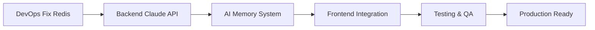

# CastMatch Week 1-2 Execution Plan - IMMEDIATE ACTION REQUIRED
## Automated Orchestration Framework v3.0
*Generated: 2025-09-05 01:30:00 IST*
*Orchestrator: Workflow Automation System*

---

## 🚨 CRITICAL STATUS UPDATE

### Current System State (Day 2 of Week 1)
- **PostgreSQL**: ✅ Operational (12+ hours stable)
- **Redis**: ⚠️ Connection issues (authentication failures) 
- **Backend**: 80% ready (blocked on Redis)
- **Frontend**: 60% ready (waiting for APIs)
- **AI Service**: 30% ready (infrastructure dependency)
- **Chat UI**: Exists but not connected to AI

### Immediate Blockers
1. **Redis authentication preventing memory system**
2. **Anthropic API not yet integrated**
3. **No streaming response implementation**
4. **Memory system architecture undefined**

---

## 📋 AGENT TASK ASSIGNMENTS - DAY 2-14

### 🔴 CRITICAL PATH AGENTS (START IMMEDIATELY)

## 1. DevOps Infrastructure Developer
**Priority**: CRITICAL - BLOCKING ALL OTHER WORK
**Current Status**: Redis failures preventing progress

### TODAY (Day 2) - EMERGENCY FIXES
```bash
# Morning (9:00-13:00)
1. Fix Redis Authentication Issue
   - Check docker-compose.yml Redis configuration
   - Remove password requirement for development
   - Test Redis connection with redis-cli
   - Verify Node.js Redis client connection
   
2. Container Health Monitoring
   - Add health checks to docker-compose.yml
   - Create restart policy for failed containers
   - Document working configuration

# Afternoon (14:00-18:00)  
3. GPU Environment Setup (for AI services)
   - Configure NVIDIA Container Toolkit if available
   - Setup CPU fallback for development
   - Prepare Python AI service container
   
4. Infrastructure Documentation
   - Create .env.example with all required variables
   - Document port mappings and service URLs
   - Setup infrastructure monitoring dashboard
```

### Days 3-5 Tasks
```yaml
Day 3:
  - Vector database setup (Pinecone/Weaviate)
  - API gateway configuration
  - Load balancer setup for scaling
  
Day 4:
  - CI/CD pipeline with GitHub Actions
  - Automated testing infrastructure
  - Production deployment preparation
  
Day 5:
  - Performance monitoring setup
  - Log aggregation system
  - Security hardening
```

**Deliverables**:
- [ ] Redis operational with memory persistence
- [ ] All containers stable 24+ hours
- [ ] Infrastructure monitoring dashboard
- [ ] CI/CD pipeline ready

---

## 2. Backend API Developer  
**Priority**: HIGH - CORE FUNCTIONALITY
**Current Status**: Waiting for Redis fix

### TODAY (Day 2) - Anthropic Integration
```typescript
// Morning (9:00-13:00) - While waiting for Redis
1. Install and Configure Anthropic
   npm install @anthropic-ai/sdk
   
2. Create Core Services
   // src/services/claude/conversation.service.ts
   - Initialize Anthropic client
   - Create conversation handler
   - Implement streaming responses
   
3. Update Chat Routes
   // src/api/routes/aiRoutes.ts
   - Add Claude endpoint
   - Implement streaming SSE
   - Add error handling

// Afternoon (14:00-18:00) - After Redis fixed
4. Memory Integration
   // src/services/memory/short-term-memory.service.ts
   - Redis session storage
   - Context preservation
   - Memory retrieval
   
5. Database Schema Updates
   // drizzle/schema/conversations.ts
   - Conversation history table
   - User preferences table
   - Memory episodes table
```

### Days 3-7 Tasks
```typescript
Day 3: Advanced Claude Features
  - Prompt engineering for casting domain
  - Response parsing and structured outputs
  - Multi-turn conversation handling
  
Day 4: Memory System Enhancement
  - Long-term memory with PostgreSQL
  - Memory consolidation algorithms
  - User preference learning
  
Day 5: API Optimization
  - Response caching
  - Rate limiting per user
  - API versioning
  
Day 6-7: Integration & Testing
  - WebSocket real-time updates
  - Conversation persistence
  - Performance optimization
```

**Deliverables**:
- [ ] Claude API responding to queries
- [ ] Streaming responses working
- [ ] Memory system operational
- [ ] <2 second response time

---

## 3. AI/ML Developer
**Priority**: HIGH - INTELLIGENCE LAYER
**Current Status**: Blocked on infrastructure

### TODAY (Day 2) - Architecture Design
```python
# Morning (9:00-13:00) - Planning Phase
1. Memory System Architecture
   - Design 3-layer memory model
   - Plan vector storage strategy
   - Define consolidation algorithms
   
2. Claude Integration Planning
   # python-ai-service/app/services/claude_service.py
   - API wrapper implementation
   - Prompt template system
   - Response parsing logic

# Afternoon (14:00-18:00) - Implementation
3. Python Service Setup
   # python-ai-service/app/main.py
   - FastAPI service structure
   - Pydantic models for data
   - Database connections
   
4. Basic Claude Integration
   # python-ai-service/app/services/conversation_engine.py
   - Simple conversation flow
   - Context management
   - Error handling
```

### Days 3-8 Tasks
```python
Day 3-4: Memory System Implementation
  - Short-term memory (Redis)
  - Long-term memory (PostgreSQL)
  - Episodic memory (Vector DB)
  
Day 5-6: Talent Matching AI
  - Profile embeddings generation
  - Similarity search algorithms
  - Recommendation engine
  
Day 7-8: Advanced Features
  - Sentiment analysis
  - Intent recognition
  - Proactive suggestions
```

**Deliverables**:
- [ ] Multi-layer memory system
- [ ] Context preservation across sessions
- [ ] Talent matching algorithms
- [ ] <500ms memory retrieval

---

## 4. Frontend UI Developer
**Priority**: MEDIUM - USER EXPERIENCE
**Current Status**: Chat UI ready, needs AI connection

### TODAY (Day 2) - UI Preparation
```typescript
// Morning (9:00-13:00)
1. Chat UI Optimization
   // frontend/app/chat/page.tsx
   - Add streaming response handler
   - Implement typing indicators
   - Add message status indicators
   
2. Real-time Features
   // frontend/lib/websocket-context.tsx
   - WebSocket connection setup
   - Server-Sent Events fallback
   - Connection state management

// Afternoon (14:00-18:00)
3. Memory Visualization
   // frontend/components/chat/MemoryIndicator.tsx
   - Show conversation context
   - Display memory retrieval
   - User preference indicators
   
4. Mobile Responsiveness
   - Touch gestures optimization
   - Mobile keyboard handling
   - Viewport adjustments
```

### Days 3-7 Tasks
```typescript
Day 3: AI Integration
  - Connect to Claude endpoints
  - Handle streaming responses
  - Error state management
  
Day 4: Conversation Management
  - Multiple chat sessions
  - Chat history navigation
  - Search within conversations
  
Day 5-6: Enhanced UX
  - Voice input/output
  - Rich media messages
  - Talent card interactions
  
Day 7: Polish & Optimization
  - Performance optimization
  - Animation refinements
  - Accessibility improvements
```

**Deliverables**:
- [ ] Streaming chat responses
- [ ] Real-time updates working
- [ ] Mobile responsive design
- [ ] <100ms UI response time

---

## 5. Testing QA Developer
**Priority**: MEDIUM - QUALITY ASSURANCE
**Current Status**: Standby, preparing frameworks

### Days 3-7 Focus (After APIs ready)
```javascript
Day 3: Test Framework Setup
  - Jest configuration for backend
  - Playwright for E2E testing
  - Performance testing tools
  
Day 4-5: API Testing
  - Claude integration tests
  - Memory system tests
  - WebSocket connection tests
  
Day 6-7: E2E Testing
  - Full conversation flow
  - Multi-user scenarios
  - Load testing (100 concurrent)
```

**Deliverables**:
- [ ] 80% code coverage
- [ ] All critical paths tested
- [ ] Performance benchmarks met
- [ ] Zero critical bugs

---

## 6. Integration Workflow Developer
**Priority**: LOW - FUTURE FEATURES
**Current Status**: Standby

### Week 2 Preparation
```typescript
Days 8-14: Foundation Work
  - OAuth2 setup (Google, LinkedIn)
  - WhatsApp Business API research
  - Calendar integration planning
  - Payment gateway preparation
```

---

## 🎨 DESIGN TRACK AGENTS (PARALLEL WORK)

## 7. Chief Design Officer
**Priority**: HIGH - VISION & QUALITY
**Timeline**: Continuous oversight

### Week 1-2 Focus
```markdown
Days 2-7: Foundation Review
  - Chat UI design approval
  - Design token system approval
  - Component library standards
  - Accessibility requirements
  
Days 8-14: Advanced Features
  - AI response visualization
  - Memory system UX
  - Mobile app designs
  - Brand guidelines
```

## 8. Design System Agents
**Active Agents**: Visual Systems, Typography, Layout Grid
**Timeline**: Week 1-5 parallel work

### Current Sprint
```css
Visual Systems Architect:
  - Design tokens (colors, spacing, shadows)
  - Component specifications
  - Dark mode preparations
  
Typography Designer:
  - Font system (Inter, system fonts)
  - Text scales and line heights
  - Content guidelines
  
Layout Grid Engineer:
  - 8-point grid system
  - Responsive breakpoints
  - Component spacing rules
```

---

## 📊 DEPENDENCY CHAINS & AUTOMATION

### Critical Path Dependencies


### Automated Handoffs
```yaml
Trigger: Redis Operational
  Action: Notify Backend & AI developers
  Payload: Connection strings, test scripts
  
Trigger: Claude API Working
  Action: Notify Frontend developer
  Payload: API docs, TypeScript interfaces
  
Trigger: End-to-End Flow Complete
  Action: Notify Testing developer
  Payload: Test scenarios, endpoints
```

---

## 🎯 SUCCESS METRICS - WEEK 1 (Days 1-7)

### Must Achieve by Day 7:
- [ ] **Infrastructure**: All services stable 48+ hours
- [ ] **Claude Integration**: Basic conversations working
- [ ] **Memory System**: Session context preserved
- [ ] **Chat UI**: Connected and responsive
- [ ] **Performance**: <2 second response time
- [ ] **Testing**: Core flows covered

### Quality Gates:
- **Day 3 Gate**: Infrastructure stable → Continue
- **Day 5 Gate**: Claude responding → Continue  
- **Day 7 Gate**: E2E working → Week 2 approved

---

## 🎯 SUCCESS METRICS - WEEK 2 (Days 8-14)

### Must Achieve by Day 14:
- [ ] **Advanced AI**: Multi-turn conversations
- [ ] **Memory**: Long-term persistence
- [ ] **Talent Search**: AI-powered matching
- [ ] **Performance**: 100 concurrent users
- [ ] **Testing**: 80% code coverage
- [ ] **Design**: Component library ready

---

## ⏰ DAILY COORDINATION SCHEDULE

### Daily Standups
```bash
09:00 - Morning Sync
  - Overnight issues review
  - Daily priorities alignment
  - Blocker identification
  
13:00 - Midday Check
  - Progress verification
  - Dependency updates
  - Resource reallocation
  
18:00 - Evening Review
  - Day completion status
  - Next day preparation
  - Escalation decisions
```

### Automated Monitoring
```bash
Every 2 Hours:
  - Service health checks
  - Progress tracking
  - Dependency verification
  - Alert generation
```

---

## 🚨 ESCALATION MATRIX

### Level 1: Agent-to-Agent (0-2 hours)
- Direct coordination
- Resource sharing
- Quick fixes

### Level 2: Orchestrator (2-6 hours)  
- Task redistribution
- Timeline adjustment
- Alternative solutions

### Level 3: Human Intervention (6+ hours)
- Strategic decisions
- Scope changes
- Budget approvals

---

## 📝 IMMEDIATE NEXT ACTIONS (NEXT 4 HOURS)

1. **DevOps**: Fix Redis authentication issue
2. **Backend**: Install Anthropic SDK, create service
3. **AI/ML**: Design memory architecture
4. **Frontend**: Prepare streaming UI handlers
5. **QA**: Setup test frameworks
6. **Design**: Review chat UI patterns

---

## 🎬 MISSION STATEMENT

**We are building the future of casting in Mumbai's entertainment industry.**

In the next 14 days, we will deliver a revolutionary conversational AI platform that understands the nuances of casting, remembers every interaction, and connects talent with opportunities seamlessly.

**Target**: Working MVP with 5+ successful end-to-end casting conversations
**Timeline**: 14 days to functional platform
**Quality**: Production-ready foundation
**Scale**: Ready for 100+ concurrent users

---

**Status**: ACTIVE COORDINATION
**Next Update**: Today 13:00 IST
**Escalations**: None currently

*Orchestrator: Revolutionizing Mumbai's casting industry, one conversation at a time* 🎬🚀