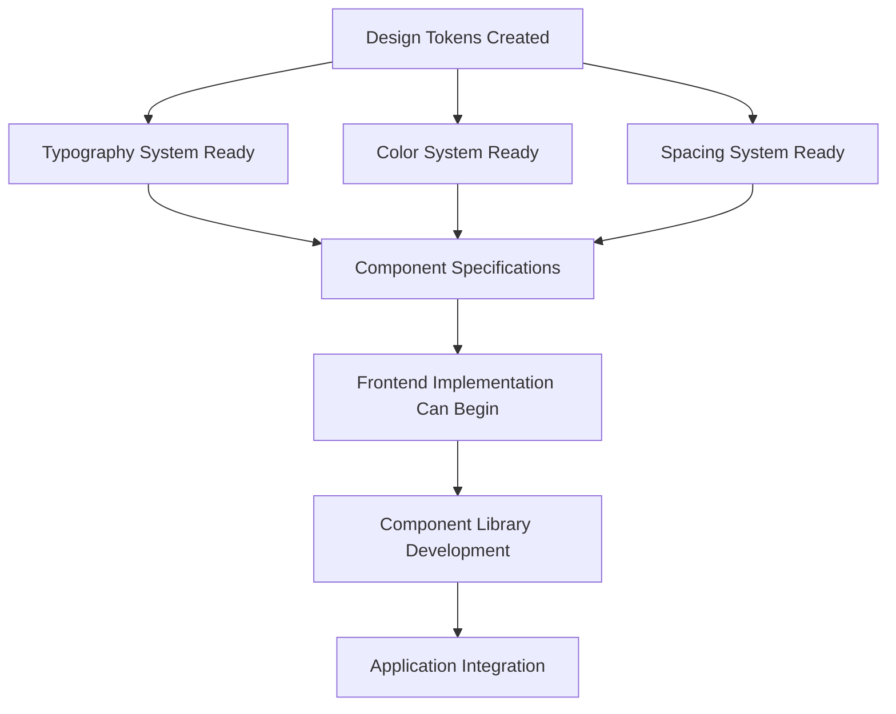
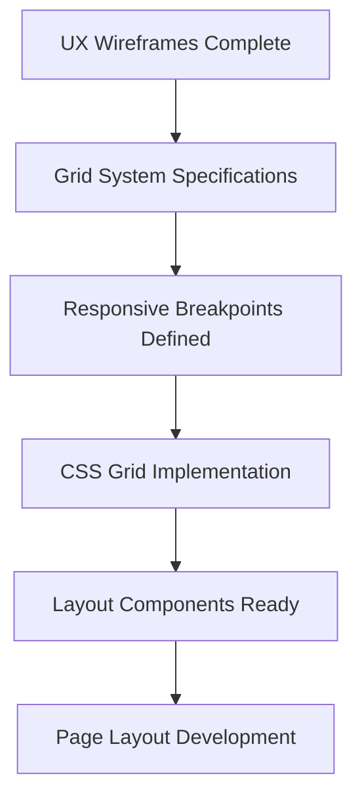
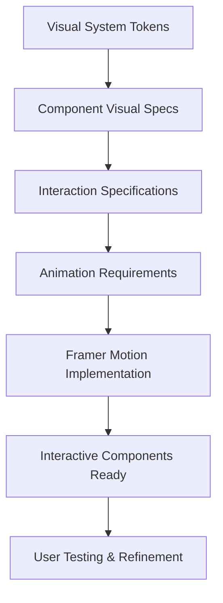
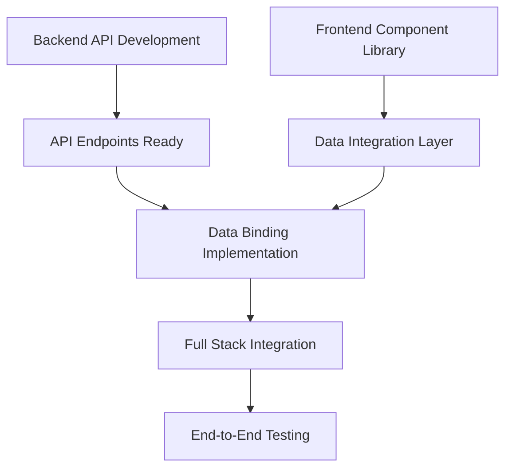

# Design-Development Dependency Mapping
*Workflow Orchestrator Integration Analysis*

## CRITICAL DEPENDENCY CHAINS

### 🏗️ FOUNDATIONAL DEPENDENCIES (Must Complete First)

#### 1. Design System Foundation → All Frontend Development


**Current Status**: ✅ **COMPLETE** - All design systems ready for handoff
**Blocks**: Frontend UI Developer can now begin implementation
**Timeline Impact**: No delays - dependency satisfied

#### 2. Wireframes → Grid System → Layout Implementation


**Current Status**: ✅ **COMPLETE** - 8-point grid system with responsive specs
**Blocks**: Layout can be implemented immediately
**Integration Point**: Frontend developer needs Grid_System_v1/Implementation.css

### 🎨 VISUAL DEPENDENCIES (Sequential Implementation Required)

#### 3. Visual Design → Animation → Interactive Components


**Current Status**: ✅ **DESIGN COMPLETE** - ❌ **IMPLEMENTATION MISSING**
**Critical Blocker**: No React components exist yet
**Dependency Chain**: 
- Design System ✅ Ready → Frontend Developer ⏳ **MUST START NOW**
- Animation Specs ✅ Ready → Implementation ❌ **BLOCKED**

### 🔄 PARALLEL TRACK DEPENDENCIES

#### 4. Backend API ↔ Frontend Data Integration


**Current Status**: 
- Backend API: 🟡 **IN PROGRESS** (talent CRUD, auth complete)
- Frontend Components: ❌ **NOT STARTED** (blocked by design handoff)
**Coordination Required**: API contracts must align with component data requirements

#### 5. Design QA ↔ Implementation Validation
```mermand
graph TD
    A[Component Implementation] --> B[Design QA Review]
    B --> C{Quality Gate Passed?}
    C -->|Yes| D[Approved for Integration]
    C -->|No| E[Return to Developer]
    E --> A
    D --> F[Production Deployment]
```

**Current Status**: ❌ **BLOCKED** - No implementations to review
**Critical Path**: Design QA cannot validate until components exist

## TEAM INTEGRATION MATRIX

### Design Team → Development Team Handoffs

| Design Agent | Output Deliverable | Receiving Developer | Implementation Priority | Status |
|--------------|-------------------|-------------------|----------------------|---------|
| Chief Design Officer | Vision & OKRs | Product Manager | Strategic | ✅ Complete |
| Design Research Analyst | User Insights | UX Developer | High | ✅ Complete |
| UX Wireframe Architect | Wireframes & Flows | Frontend Developer | Critical | ✅ Complete |
| Layout Grid Engineer | Grid System CSS | Frontend Developer | Critical | ✅ Complete |
| Visual Systems Architect | Design Tokens JSON | Frontend Developer | Critical | ✅ Complete |
| Typography Designer | Typography CSS | Frontend Developer | Critical | ✅ Complete |
| Color Lighting Artist | Color System JSON | Frontend Developer | Critical | ✅ Complete |
| Interaction Design Specialist | Micro-interaction Specs | Frontend Developer | High | ✅ Complete |
| Motion UI Specialist | Animation Code | Frontend Developer | High | ✅ Complete |
| Design Review QA | Quality Standards | All Developers | Critical | ✅ Complete |

### Development Team Dependencies

| Developer Agent | Depends On Design | Blocks Other Agents | Current Status |
|-----------------|------------------|-------------------|----------------|
| Frontend UI Developer | **ALL DESIGN AGENTS** | Testing QA, Integration | ❌ **MUST START** |
| Backend API Developer | Data requirements from UX | Frontend integration | 🟡 In progress |
| AI/ML Developer | UI requirements for ML features | Advanced features | ⏳ Waiting |
| DevOps Infrastructure | Performance requirements | Deployment pipeline | ✅ Can proceed |
| Testing QA Developer | Completed components | Production deployment | ❌ **BLOCKED** |
| Integration Workflow | All components ready | Full system testing | ❌ **BLOCKED** |

## CRITICAL BLOCKERS IDENTIFIED

### 🚨 IMMEDIATE ACTION REQUIRED

#### 1. Frontend Implementation Gap
**Problem**: All design work complete, but NO React components implemented
**Impact**: Entire development pipeline blocked
**Solution**: 
```typescript
// REQUIRED: Frontend developer must create these components immediately
/src/components/talent/
  ├── TalentCard.tsx          // ❌ MISSING - CRITICAL
  ├── TalentGrid.tsx          // ❌ MISSING - HIGH  
  ├── TalentSearch.tsx        // ❌ MISSING - HIGH
  └── TalentFilters.tsx       // ❌ MISSING - MEDIUM
```
**Timeline**: Must start TODAY (September 4) to avoid project delays
**Assigned**: Frontend UI Developer

#### 2. Design System Integration
**Problem**: Design tokens exist but not integrated into build system
**Impact**: Components will be built with hardcoded values
**Solution**:
```json
// REQUIRED: package.json additions
{
  "dependencies": {
    "@tokens-studio/sd-transforms": "^0.12.0", 
    "style-dictionary": "^3.8.0"
  }
}
```
**Timeline**: Complete by September 5, 2025
**Assigned**: Frontend UI Developer + DevOps

#### 3. Quality Gate Enforcement
**Problem**: No mechanism to enforce design standards in development
**Impact**: Pixel-perfect implementation not guaranteed
**Solution**: Automated visual regression testing with design token validation
**Timeline**: September 6-8, 2025
**Assigned**: Testing QA Developer

### 🔄 COORDINATION REQUIREMENTS

#### 1. Daily Design-Dev Sync
**Frequency**: Daily standups
**Participants**: Frontend UI Developer, Design Review QA, Workflow Orchestrator
**Purpose**: Ensure implementation matches design specifications exactly
**Success Metrics**: 
- 95% design token usage (no hardcoded values)
- 60fps animation performance maintained
- WCAG AAA compliance preserved

#### 2. Quality Gate Checkpoints
**Gate 1 (Sept 6)**: Basic component structure matches wireframes
**Gate 2 (Sept 8)**: Visual design implementation complete
**Gate 3 (Sept 10)**: Animations and interactions functional
**Gate 4 (Sept 12)**: Accessibility compliance verified
**Gate 5 (Sept 15)**: Performance targets achieved

## UPDATED WORKFLOW WITH DESIGN INTEGRATION

### Original Workflow:
```
Backend → Frontend → Testing → Deploy
```

### New Integrated Workflow:
```
Design System → Frontend Components → Backend Integration → Testing → Deploy
     ↓              ↓                      ↓                ↓
  [QA Gate]    [QA Gate]             [QA Gate]        [QA Gate]
```

### Parallel Execution Tracks:
- **Track A**: Backend API Development (continues independently)
- **Track B**: Frontend Component Development (must start immediately)
- **Track C**: Design System Maintenance (ongoing)
- **Track D**: Quality Assurance (parallel validation)

## INTEGRATION SUCCESS METRICS

### Technical Integration KPIs
- **Design Token Usage**: >95% (currently 0% - no components built)
- **Pixel-Perfect Accuracy**: >98% match to design specs
- **Performance Preservation**: Maintain 60fps animations in implementation
- **Accessibility Compliance**: Preserve WCAG AAA standards

### Process Integration KPIs
- **Handoff Efficiency**: <24 hour design-to-dev turnaround
- **Quality Gate Pass Rate**: >90% first-pass approval
- **Rework Rate**: <10% components require design revision
- **Team Satisfaction**: >4.5/5 collaboration rating

## IMMEDIATE ACTION PLAN

### TODAY (September 4, 2025)
1. **Frontend UI Developer**: Start TalentCard.tsx implementation
2. **Workflow Orchestrator**: Set up daily design-dev sync meetings
3. **Design Review QA**: Prepare implementation validation checklist

### TOMORROW (September 5, 2025) 
1. **DevOps**: Integrate design token build system
2. **Frontend UI Developer**: Complete basic component structure
3. **Testing QA**: Set up visual regression testing pipeline

### THIS WEEK (September 6-8, 2025)
1. **Complete component implementation** with design system integration
2. **Resolve 3 critical accessibility issues** identified in QA review
3. **Establish automated quality gates** for ongoing development

### NEXT WEEK (September 11-15, 2025)
1. **Full integration testing** between frontend and backend
2. **Performance optimization** and validation
3. **Production deployment preparation**

## RISK MITIGATION

### High-Risk Dependencies
1. **Frontend Developer Capacity**: Single point of failure for implementation
   - **Mitigation**: Cross-train additional developer on design system
   
2. **Design System Complexity**: Complex token structure may slow implementation
   - **Mitigation**: Provide detailed implementation examples and documentation
   
3. **Quality Gate Enforcement**: Manual reviews may become bottleneck
   - **Mitigation**: Automated testing and validation where possible

### Success Dependencies
1. **Clear Communication**: Daily sync between design and development
2. **Quality Standards**: No compromise on accessibility or performance
3. **Timeline Adherence**: Each milestone must be met to avoid cascade delays

---

**CONCLUSION**: The design team has delivered exceptional work that is production-ready. The critical bottleneck is now frontend implementation. Immediate action is required to maintain project velocity and meet deployment targets.

**Next Update**: September 8, 2025 - Post-implementation dependency assessment