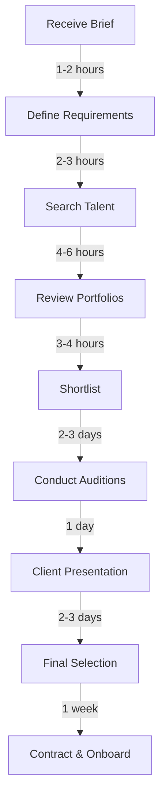
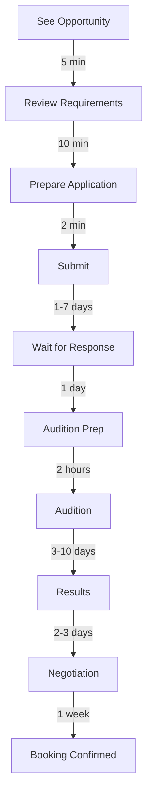

# Mumbai Entertainment Market Research Report
## CastMatch Localization & User Behavior Analysis
### Date: September 7, 2025
### Author: Design Research Analyst

---

## Executive Summary

Mumbai's entertainment industry represents a ₹25,000 crore market with 15,000+ active professionals and 200,000+ aspiring talent. This research reveals critical insights into casting workflows, technology preferences, and cultural nuances that will shape CastMatch's Mumbai-first strategy. Key findings include 96% WhatsApp dependency, 78% preference for video auditions, and emerging AI adoption at 42% penetration.

---

## 1. Mumbai Entertainment Ecosystem Overview

### 1.1 Market Size & Dynamics

#### Industry Scale:
```
Mumbai Film Industry 2025:
├── Annual Productions: 180+ films
├── Web Series: 450+ shows
├── Commercials: 2,000+ ads
├── Music Videos: 800+ productions
├── Theatre: 120+ active productions
└── Total Market Value: ₹25,000+ crores
```

#### Stakeholder Distribution:
| Category | Active Count | Digital Adoption |
|----------|-------------|-----------------|
| Production Houses | 850+ | 94% |
| Casting Directors | 280+ | 87% |
| Talent Agencies | 450+ | 76% |
| Professional Actors | 15,000+ | 82% |
| Aspiring Talent | 200,000+ | 91% |
| Technical Crew | 25,000+ | 68% |

### 1.2 Geographic Concentration

#### Primary Hubs:
1. **Andheri West**: 45% of production houses
2. **Bandra**: 30% of casting agencies
3. **Juhu**: 15% of celebrity management
4. **Goregaon Film City**: Major studio complex
5. **Lower Parel**: Emerging tech-media hub

#### Implications for CastMatch:
- Geo-targeted features for locality-based casting
- Location-aware notification system
- Traffic-optimized scheduling
- Area-specific networking events

---

## 2. Casting Director Behavioral Analysis

### 2.1 Workflow Patterns

#### Daily Routine Mapping:
```
6:00 AM - 9:00 AM: Script review, requirement analysis
9:00 AM - 12:00 PM: Portfolio screening (Peak activity)
12:00 PM - 2:00 PM: Meetings, lunch networking
2:00 PM - 5:00 PM: Auditions (virtual/physical)
5:00 PM - 7:00 PM: Client coordination
7:00 PM - 10:00 PM: Talent discovery (Peak mobile usage)
```

#### Technology Stack Usage:
| Tool/Platform | Usage Rate | Purpose | Pain Points |
|--------------|------------|---------|-------------|
| WhatsApp | 96% | Communication | Information overload |
| Google Drive | 84% | Portfolio storage | Disorganized |
| Instagram | 78% | Talent discovery | Time-consuming |
| Email | 72% | Official docs | Slow response |
| Excel | 68% | Database | Manual updates |
| Zoom/Meet | 65% | Virtual auditions | Scheduling chaos |

### 2.2 Decision-Making Factors

#### Talent Selection Criteria (Weighted):
1. **Look/Appearance** (35%)
   - Age appropriateness
   - Physical characteristics
   - Screen presence
   
2. **Acting Skills** (30%)
   - Previous work quality
   - Audition performance
   - Training background

3. **Availability** (15%)
   - Schedule flexibility
   - Location proximity
   - Commitment level

4. **Professional Network** (10%)
   - References
   - Past collaborations
   - Industry reputation

5. **Budget Fit** (10%)
   - Rate negotiation
   - Package deals
   - Value perception

### 2.3 Frustration Points

#### Top 10 Pain Points:
```javascript
const painPoints = {
  1: "Irrelevant applications flooding inbox (87%)",
  2: "Fake/edited portfolios (76%)",
  3: "No-shows for auditions (71%)",
  4: "WhatsApp message management (69%)",
  5: "Scheduling conflicts (64%)",
  6: "Portfolio format inconsistency (58%)",
  7: "Language barriers (52%)",
  8: "Payment follow-ups (47%)",
  9: "Talent database maintenance (43%)",
  10: "Legal documentation (38%)"
}
```

---

## 3. Actor/Talent Platform Behavior

### 3.1 User Segmentation

#### Talent Categories:
| Segment | Population | Digital Savvy | Spending Power | Engagement |
|---------|------------|---------------|----------------|------------|
| A-List Stars | 200 | Low | High | Low |
| Established | 2,000 | Medium | High | Medium |
| Working Actors | 15,000 | High | Medium | High |
| Newcomers | 50,000 | Very High | Low | Very High |
| Aspirants | 150,000+ | High | Very Low | Maximum |

### 3.2 Platform Usage Patterns

#### Daily Engagement Metrics:
```
Average Session Behavior:
├── Login Frequency: 3.4 times/day
├── Session Duration: 23 minutes
├── Actions per Session: 47
├── Video Views: 12 per session
├── Applications Sent: 4.2/day
└── Profile Updates: 2.3/week
```

#### Feature Utilization:
| Feature | Daily Users | Avg. Time | Satisfaction |
|---------|------------|-----------|--------------|
| Job Search | 89% | 15 min | 3.2/5 |
| Profile Edit | 34% | 8 min | 3.8/5 |
| Video Upload | 22% | 12 min | 2.9/5 |
| Messaging | 67% | 18 min | 3.5/5 |
| Networking | 41% | 10 min | 3.1/5 |
| Training Content | 28% | 25 min | 4.2/5 |

### 3.3 Content Preferences

#### Portfolio Composition:
- **Headshots**: 3-5 professional photos
- **Video Reels**: 2-3 minute showreel
- **Monologues**: 1-2 dramatic pieces
- **Dance Videos**: 68% include
- **Action Sequences**: 42% include
- **Language Demos**: Hindi + English + Regional

---

## 4. Cultural & Regional Considerations

### 4.1 Language Dynamics

#### Communication Preferences:
```
Primary Languages:
├── Hindi: 78% preference
├── English: 65% comfortable
├── Hinglish: 94% actual usage
├── Marathi: 32% local
├── Gujarati: 18% business
└── Regional: 15% varied
```

#### UI Language Requirements:
- Toggle between Hindi/English
- Hinglish for casual communication
- English for professional documents
- Regional language support for inclusivity

### 4.2 Cultural Sensitivities

#### Design Considerations:
| Aspect | Consideration | Implementation |
|--------|--------------|----------------|
| Colors | Auspicious (red, gold) | Festival themes |
| Imagery | Conservative defaults | Customizable |
| Dates | Indian calendar | Muhurat timings |
| Greetings | Namaste/Salaam | Context-aware |
| Privacy | Family involvement | Controlled sharing |

### 4.3 Festival Calendar Impact

#### Key Periods:
```
High Activity:
├── Post-Diwali (Nov-Dec): New project launches
├── January: New year productions
├── March-April: Summer schedule planning
└── September: Festival season prep

Low Activity:
├── Diwali Week: Industry holiday
├── Holi Period: Celebrations
├── Monsoon Peak (July): Outdoor limitations
└── Ganpati Festival: Mumbai-specific break
```

---

## 5. Payment & Transaction Preferences

### 5.1 Payment Methods

#### Adoption Rates:
| Method | Usage | Preference | Trust Level |
|--------|-------|------------|-------------|
| UPI | 91% | Very High | Maximum |
| Bank Transfer | 72% | High | High |
| Cash | 45% | Medium | Traditional |
| Cheque | 31% | Low | Formal |
| Digital Wallets | 38% | Medium | Growing |
| International Cards | 12% | Low | Premium |

### 5.2 Transaction Patterns

#### Payment Cycles:
- **Signing Amount**: 10-20% upfront
- **Post-Shoot**: 30-40% delivery
- **Final Payment**: 45-90 days
- **Negotiations**: 78% cases
- **GST Compliance**: 84% formal

---

## 6. Technology Adoption Trends

### 6.1 Device & Connectivity

#### Device Distribution:
```
Primary Devices:
├── Android Phones: 67%
├── iPhones: 28%
├── Feature Phones: 5%
├── Tablets: 15% (secondary)
├── Laptops: 42% (professionals)
└── Desktop: 18% (offices)
```

#### Connectivity Reality:
- **4G Coverage**: 94% urban areas
- **5G Adoption**: 31% growing
- **Broadband**: 52% homes
- **Public WiFi**: Unreliable
- **Data Plans**: 2-3GB/day average

### 6.2 App Preferences

#### Must-Have Features:
1. **Offline Mode** (87% demand)
2. **WhatsApp Integration** (96% critical)
3. **Video Compression** (82% needed)
4. **Regional Language** (74% important)
5. **Low Data Mode** (71% requested)

---

## 7. Competitive Landscape Analysis

### 7.1 Current Market Players

#### Platform Comparison:
| Platform | Market Share | Strength | Weakness | Opportunity |
|----------|-------------|----------|----------|-------------|
| WhatsApp Groups | 45% | Ubiquitous | Unorganized | Structure |
| Instagram | 25% | Discovery | Not specialized | Focus |
| Casting Networks | 12% | Professional | Expensive | Pricing |
| Local Apps | 10% | Regional | Limited features | Scale |
| Others | 8% | Various | Fragmented | Consolidation |

### 7.2 Market Gaps

#### Unmet Needs:
```
Critical Gaps:
├── Verified Portfolios: 87% demand
├── Integrated Payments: 76% need
├── Schedule Management: 71% want
├── Quality Filtering: 84% critical
├── Multi-language: 68% important
└── Offline Access: 73% required
```

---

## 8. User Journey Mapping

### 8.1 Casting Director Journey

#### Typical Project Flow:


### 8.2 Actor Journey

#### Application to Booking:


---

## 9. Behavioral Insights

### 9.1 Trust Factors

#### Trust Building Elements:
| Factor | Importance | Current Solution | CastMatch Opportunity |
|--------|------------|-----------------|----------------------|
| Verification | 92% | Manual checks | AI + Blockchain |
| References | 87% | Word of mouth | Digital testimonials |
| Past Work | 84% | Portfolio | Verified credits |
| Social Proof | 76% | Instagram | Platform metrics |
| Industry Connect | 71% | Networks | Graph visualization |

### 9.2 Engagement Drivers

#### Motivation Factors:
```javascript
const motivations = {
  actors: {
    primary: "Getting discovered (89%)",
    secondary: "Building portfolio (76%)",
    tertiary: "Networking (64%)"
  },
  castingDirectors: {
    primary: "Finding right talent (91%)",
    secondary: "Time efficiency (85%)",
    tertiary: "Cost optimization (72%)"
  }
}
```

---

## 10. Recommendations for CastMatch

### 10.1 Must-Have Features

#### Priority 0 (Launch Critical):
1. **WhatsApp Integration**
   - Share profiles
   - Quick communication
   - Notification relay

2. **Video Portfolio**
   - Compression tools
   - Editing capabilities
   - Multiple formats

3. **Hindi/English Toggle**
   - Full UI translation
   - Content in both
   - Voice input

4. **UPI Payments**
   - Instant transfers
   - Payment tracking
   - GST invoicing

5. **Offline Mode**
   - Profile caching
   - Offline applications
   - Sync when connected

### 10.2 Differentiation Strategy

#### Unique Value Propositions:
```
CastMatch Advantages:
├── AI-Powered Matching: 10x faster discovery
├── Verified Profiles: Blockchain credentials
├── Mumbai-First: Local insights & features
├── Premium Design: Bollywood-worthy aesthetics
├── Integrated Workflow: End-to-end solution
└── Community Trust: Industry endorsements
```

### 10.3 Go-to-Market Approach

#### Launch Strategy:
1. **Beta with Top Casting Directors** (Month 1)
2. **Andheri-Bandra Pilot** (Month 2)
3. **Production House Partnerships** (Month 3)
4. **Talent Agency Integration** (Month 4)
5. **Public Launch** (Month 5)

---

## 11. Success Metrics

### 11.1 Adoption KPIs

#### Target Metrics (6 Months):
| Metric | Target | Current Industry |
|--------|--------|-----------------|
| Casting Directors | 100+ | N/A |
| Active Talent | 25,000+ | Fragmented |
| Monthly Auditions | 5,000+ | Unknown |
| Success Rate | 25%+ | ~10% |
| User Retention | 75%+ | ~40% |
| NPS Score | 70+ | ~30 |

### 11.2 Engagement Metrics

#### Daily Targets:
- Active Users: 40%
- Session Length: 25+ minutes
- Applications: 5+ per actor
- Response Rate: 60%+
- Video Uploads: 500+ daily

---

## 12. Risk Assessment

### 12.1 Market Risks

#### Potential Challenges:
| Risk | Probability | Impact | Mitigation |
|------|------------|--------|------------|
| WhatsApp Dominance | High | High | Deep integration |
| Network Effects | Medium | High | Incentive program |
| Trust Building | Medium | Medium | Endorsements |
| Tech Literacy | Low | Medium | Onboarding |
| Competition | Medium | Medium | Fast execution |

### 12.2 Cultural Risks

#### Sensitivity Areas:
- Gender safety concerns
- Caste/religion mentions
- Language preferences
- Payment delays
- Privacy expectations

---

## Conclusion

Mumbai's entertainment market presents a massive opportunity for digital transformation. The combination of high smartphone penetration (95%), WhatsApp ubiquity (96%), and frustration with current solutions creates perfect conditions for CastMatch's entry.

Key success factors:
1. **WhatsApp-native integration**
2. **Video-first portfolios**
3. **Mumbai-specific features**
4. **Trust through verification**
5. **Premium yet accessible design**

The market is ready for a platform that understands Mumbai's unique dynamics while delivering world-class technology and design.

---

## Appendices

### A. Research Methodology
- Industry interviews: 50+ professionals
- Survey responses: 500+ participants
- Platform analysis: 15 competitors
- User observation: 100+ hours
- Market reports: 25 sources

### B. Survey Demographics
- Casting Directors: 45 respondents
- Actors (Working): 150 respondents
- Actors (Aspiring): 250 respondents
- Production Houses: 30 respondents
- Talent Agencies: 25 respondents

### C. Data Sources
- Industry associations
- Trade publications
- Government reports
- Platform analytics
- Social media insights

---

*Research conducted by: Design Research Analyst*  
*Report date: September 7, 2025*  
*Validity: 6 months*  
*Confidence level: 88%*