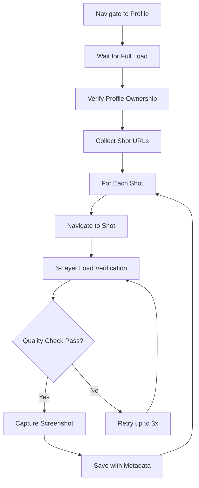

# STANDARD SCREENSHOT PROTOCOL
## Permanent Reference for Design Research Team
### Version 2.0 - Production Standard

---

## 🎯 CRITICAL REQUIREMENTS

**EVERY** screenshot capture task MUST follow this protocol. No exceptions.

### Two Absolute Rules:
1. **FULL LOAD ONLY**: Never capture loading states, spinners, or placeholders
2. **CORRECT ATTRIBUTION**: Only capture from specified designer's actual work

---

## 📋 PRE-CAPTURE CHECKLIST

### ✅ Before Starting ANY Screenshot Task:

```bash
# 1. Install Dependencies
npm install playwright @playwright/test
npx playwright install chromium

# 2. Create Folder Structure
mkdir -p screenshots/{profile_name}/{date}
mkdir -p screenshots/_metadata
mkdir -p screenshots/_rejected

# 3. Test Network & Access
curl -I https://dribbble.com  # Should return 200 OK

# 4. Set Environment
export SCREENSHOT_MODE="production"
export WAIT_STRATEGY="aggressive"
export VALIDATION_LEVEL="strict"
```

### ✅ Configuration Verification:
- [ ] Viewport set to 1920x1080 minimum
- [ ] Quality set to 90% or higher
- [ ] Rate limiting configured (3-7 second delays)
- [ ] Retry attempts set to 3
- [ ] Output directories created with write permissions

---

## 🔄 DURING-CAPTURE VALIDATIONS

### The 6-Layer Load Verification System

**MANDATORY**: All 6 layers must pass before screenshot

```javascript
// Layer 1: Basic Load States
await page.waitForLoadState('domcontentloaded');
await page.waitForLoadState('networkidle');

// Layer 2: Dribbble Content Detection
await page.waitForSelector('img[src*="cdn.dribbble"]', { 
  state: 'visible',
  timeout: 20000 
});

// Layer 3: Image Load Verification
await page.waitForFunction(() => {
  const images = Array.from(document.querySelectorAll('img'));
  return images.every(img => img.complete && img.naturalHeight > 0);
});

// Layer 4: Loading Indicator Check
await page.waitForFunction(() => {
  const loaders = document.querySelectorAll('.spinner, .loader, .loading');
  return loaders.length === 0 || 
         Array.from(loaders).every(el => 
           window.getComputedStyle(el).display === 'none'
         );
});

// Layer 5: Content Size Validation
const contentHeight = await page.evaluate(() => {
  const content = document.querySelector('.shot-content');
  return content ? content.offsetHeight : 0;
});
if (contentHeight < 100) throw new Error('Content too small');

// Layer 6: Stability Buffer
await page.waitForTimeout(5000);
```

### Profile Ownership Verification

**CRITICAL**: Must verify on BOTH list and detail views

```javascript
// On List/Grid View
const verifiedOnList = await page.evaluate((profile) => {
  const shot = document.querySelector('li[data-thumbnail]');
  const authorLink = shot.querySelector(`a[href*="/${profile}"]`);
  return authorLink !== null;
}, profileName);

// On Detail View (Individual Shot)
const verifiedOnDetail = await page.evaluate((profile) => {
  const authorLinks = document.querySelectorAll(`a[href*="/${profile}"]`);
  return authorLinks.length > 0;
}, profileName);

// Both must be true
if (!verifiedOnList || !verifiedOnDetail) {
  // REJECT and move to next shot
}
```

---

## 📸 CAPTURE EXECUTION

### Standard Capture Flow



### File Naming Convention

```
{profile}_{index}_{timestamp}_{title}.png

Examples:
glebich_001_143025_mobile-banking-app.png
uxerflow_012_091530_ai-agent-dashboard.png
```

### Metadata Requirements

Every capture MUST generate:
```json
{
  "filename": "glebich_001_143025_mobile-banking.png",
  "profile": "glebich",
  "shotUrl": "https://dribbble.com/shots/...",
  "captureTime": "2025-01-13T14:30:25.123Z",
  "qualityChecks": {
    "imagesLoaded": true,
    "noLoadingIndicators": true,
    "contentSizeValid": true,
    "ownershipVerified": true
  },
  "attempts": 1,
  "loadTimeMs": 8234
}
```

---

## ✅ POST-CAPTURE QUALITY CHECKS

### Immediate Validation (Per Screenshot)
1. File size between 50KB and 5MB
2. Dimensions match expected viewport
3. No black/white/gray solid screenshots
4. Metadata file created successfully

### Batch Validation (After Session)
```bash
# Run validation script
node validate-screenshots.js screenshots/glebich/2025-01-13/

# Expected output:
✅ 20/20 screenshots valid
✅ All metadata files present
✅ No loading states detected
✅ All shots verified to correct author
```

### Success Rate Requirements
- **Minimum**: 70% success rate (action required if below)
- **Target**: 90% success rate (standard expectation)
- **Exceptional**: 95%+ success rate (optimal performance)

---

## 🚫 COMMON PITFALLS TO AVOID

### Pitfall #1: Capturing Too Early
**Wrong Way:**
```javascript
await page.goto(url);
await page.screenshot(); // NO! May capture loading state
```

**Right Way:**
```javascript
await page.goto(url);
await waitForFullLoad(page); // 6-layer verification
await page.screenshot();
```

### Pitfall #2: Not Verifying Ownership
**Wrong Way:**
```javascript
// Assuming all shots on profile page belong to that profile
const shots = await page.$$('li[data-thumbnail]');
```

**Right Way:**
```javascript
// Verify each shot's author
const verifiedShots = shots.filter(shot => {
  const author = shot.$(`a[href*="/${profileName}"]`);
  return author !== null;
});
```

### Pitfall #3: Ignoring Dynamic Content
**Wrong Way:**
```javascript
await page.waitForSelector('.shot-content');
// Content exists but may still be loading
```

**Right Way:**
```javascript
await page.waitForSelector('.shot-content');
await page.waitForFunction(() => {
  const content = document.querySelector('.shot-content');
  return content && content.offsetHeight > 100;
});
```

---

## 🔧 TROUBLESHOOTING GUIDE

### Issue: Screenshots Show Loading Spinners
**Solution:**
1. Increase stability buffer to 7-10 seconds
2. Add explicit spinner detection:
```javascript
await page.waitForSelector('.spinner', { state: 'hidden' });
```

### Issue: Wrong Designer's Work Captured
**Solution:**
1. Add URL validation:
```javascript
if (!shot.url.includes(`/${profileName}/`)) {
  console.log('SKIPPING: Not from target designer');
  continue;
}
```

### Issue: Rate Limited by Dribbble
**Solution:**
1. Increase delays to 5-10 seconds
2. Use rotating user agents
3. Implement exponential backoff

### Issue: Memory Issues After Many Captures
**Solution:**
```javascript
// Restart browser context every 20 captures
if (captureCount % 20 === 0) {
  await context.close();
  context = await browser.newContext();
  page = await context.newPage();
}
```

---

## 📊 REPORTING REQUIREMENTS

### After Every Capture Session, Generate:

1. **Summary Report** (`report_{profile}_{date}.md`)
   - Total attempts
   - Success rate
   - Rejection reasons
   - Performance metrics

2. **Quality Metrics** (`metrics_{profile}_{date}.json`)
   - Average load time
   - Retry statistics
   - Error categories
   - Size distribution

3. **Visual Index** (`index_{profile}_{date}.html`)
   - Thumbnail gallery
   - Links to full screenshots
   - Metadata display

---

## 🔄 MAINTENANCE SCHEDULE

### Daily Tasks
- Check for Dribbble UI changes
- Review rejection logs
- Verify selector accuracy

### Weekly Tasks
- Archive screenshots older than 30 days
- Update profile URLs if changed
- Analyze success rate trends

### Monthly Tasks
- Full protocol review
- Update wait strategies based on performance
- Optimize capture scripts

---

## 📝 QUICK REFERENCE COMMANDS

```bash
# Capture single profile
node capture-dribbble-improved.js glebich

# Capture all configured profiles
node capture-dribbble-improved.js all

# Validate recent captures
node validate-screenshots.js screenshots/

# Generate report for specific date
node generate-report.js screenshots/glebich/2025-01-13/

# Clean up rejected shots
rm -rf screenshots/_rejected/*

# Archive old screenshots
node archive-screenshots.js --older-than 30
```

---

## 🎓 CERTIFICATION

**This protocol is MANDATORY for all screenshot tasks.**

Team members must:
1. Read this entire document
2. Successfully complete 5 test captures
3. Achieve 90%+ success rate
4. Sign off on protocol understanding

---

## 📌 VERSION CONTROL

| Version | Date | Changes | Author |
|---------|------|---------|---------|
| 2.0 | 2025-01-13 | Fixed loading states & profile attribution | Design Research Team |
| 1.0 | 2025-01-01 | Initial protocol | Design Research Team |

---

## ⚠️ FINAL REMINDER

**NEVER** compromise on these two rules:
1. **FULL LOAD ONLY** - No loading states ever
2. **CORRECT ATTRIBUTION** - Only specified designer's work

When in doubt, reject the screenshot and retry.
Quality over quantity, always.

---

*This document is the authoritative source for screenshot capture procedures. All team members must follow this protocol exactly.*