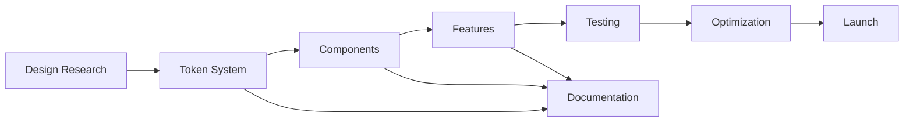

# CastMatch Executive Design Vision
## Strategic Design Implementation Plan 2025

### Executive Summary
CastMatch will establish itself as the premium casting platform for Mumbai's entertainment industry by combining Bollywood's visual language with Silicon Valley's technical excellence. Our design philosophy centers on "Cinematic Simplicity" - powerful features wrapped in intuitive, culturally-resonant interfaces.

---

## 1. EXECUTIVE VISION STATEMENT

### Design Philosophy
**"Where Mumbai Cinema Meets Digital Excellence"**

We are building more than a casting platform - we're creating a digital ecosystem that honors the artistry of Mumbai's entertainment industry while leveraging cutting-edge technology to democratize talent discovery.

### Core Design Principles
1. **Cinematic Dark Elegance**: OLED-optimized dark interfaces with vibrant accent colors (#FF6B6B, #4ECDC4) that evoke stage lighting
2. **Mobile-First Mumbai**: Every interaction designed for one-handed use on mid-range Android devices
3. **Trust Through Transparency**: Verified badges, transparent pricing, clear communication channels
4. **Performance as Feature**: Sub-1.5s FCP, offline-capable, data-efficient
5. **Inclusive by Design**: WCAG AAA compliance, multilingual support (Hindi, English, Marathi)

### Unique Market Positioning
- **For Casting Directors**: "Find talent in seconds, not hours"
- **For Talent**: "Your digital portfolio that works 24/7"
- **Market Differentiator**: Only platform with AI-powered talent matching specifically trained on Bollywood casting patterns

### Success Metrics & KPIs

#### User Experience Metrics
- Task Completion Rate: >85% for core flows
- Time to First Audition: <3 minutes
- Profile Completion Rate: >80%
- User Satisfaction Score: 4.8/5

#### Business Impact Metrics
- Monthly Active Users: 50,000 by Q2 2025
- Talent Database: 100,000 verified profiles
- Successful Castings: 1,000/month
- Platform Revenue: ₹50L/month by Q3

#### Performance Metrics
- First Contentful Paint: <1.5s
- Time to Interactive: <3.5s
- Lighthouse Score: >95
- Core Web Vitals: All green

---

## 2. PHASE-BASED IMPLEMENTATION ROADMAP

### Phase 1: Foundation (Week 1-2)
**Theme: "Building the Stage"**

#### Deliverables
- Design token architecture (200+ tokens)
- Core component library (30 components)
- Dark mode color system
- Typography scale (Mumbai-inspired)
- Grid system (8px base, 12-column)

#### Key Components
```
- Navigation (bottom tab for mobile)
- Talent Cards (image-forward)
- Search Interface (AI-powered)
- Profile Templates (role-specific)
- Authentication Flow (OTP-based)
```

#### Success Criteria
- 100% token coverage
- Component documentation complete
- Accessibility audit passed
- Performance budgets established

### Phase 2: Core Features (Week 3-4)
**Theme: "Spotlight on Talent"**

#### Deliverables
- Talent Discovery System
- Profile Builder (wizard-based)
- Audition Management
- Messaging System
- Video Player (optimized)

#### Mumbai-Specific Features
- WhatsApp Integration API
- Regional Language Support
- Local Payment Methods
- Offline Mode (Progressive Web App)

#### Success Criteria
- User testing score >8/10
- Load time <2s for all pages
- 0 critical accessibility issues
- API response time <200ms

### Phase 3: Advanced Features (Week 5-6)
**Theme: "AI Director's Assistant"**

#### Deliverables
- AI Talent Matching Engine
- Virtual Audition Studio
- Real-time Collaboration Tools
- Advanced Analytics Dashboard
- Blockchain Verification System

#### Innovation Features
```json
{
  "ai_features": {
    "smart_search": "Natural language queries",
    "auto_tagging": "Skill extraction from videos",
    "compatibility_score": "Role-talent matching",
    "trend_prediction": "Upcoming talent types"
  },
  "virtual_studio": {
    "green_screen": "Real-time background replacement",
    "script_reader": "Teleprompter mode",
    "multi_angle": "3-camera simulation",
    "live_direction": "Remote feedback tools"
  }
}
```

#### Success Criteria
- AI accuracy >90%
- Virtual studio latency <50ms
- Collaboration tools user adoption >60%
- Zero blockchain transaction failures

### Phase 4: Optimization & Launch (Week 7-8)
**Theme: "Opening Night"**

#### Deliverables
- Performance Optimization
- Security Hardening
- Launch Campaign Assets
- Documentation & Training
- Production Deployment

#### Launch Readiness Checklist
- [ ] Load testing (10,000 concurrent users)
- [ ] Security penetration testing
- [ ] GDPR/Privacy compliance
- [ ] Multi-device QA complete
- [ ] Disaster recovery tested
- [ ] Customer support trained

---

## 3. DESIGN SYSTEM EVOLUTION

### Token Architecture Priorities

#### Tier 1: Primitive Tokens (Week 1)
```json
{
  "colors": {
    "primary": "#FF6B6B",
    "secondary": "#4ECDC4",
    "neutral": "11 shades",
    "semantic": "success/warning/error/info"
  },
  "typography": {
    "scale": "1.25 ratio",
    "families": ["Inter", "Noto Sans Devanagari"],
    "weights": [400, 500, 600, 700, 900]
  },
  "spacing": {
    "base": "8px",
    "scale": [0, 4, 8, 12, 16, 24, 32, 48, 64, 96]
  }
}
```

#### Tier 2: Semantic Tokens (Week 2)
- Surface colors (6 elevation levels)
- Interactive states (hover, active, disabled)
- Motion tokens (timing, easing)
- Shadow system (5 levels)

#### Tier 3: Component Tokens (Week 3-4)
- Button variants (5 types x 3 sizes)
- Card layouts (4 types)
- Form elements (12 components)
- Navigation patterns (3 types)

### Dark Mode Implementation Strategy

#### Technical Approach
```css
/* CSS Custom Properties with System Preference Detection */
:root {
  --color-scheme: 'light';
}

@media (prefers-color-scheme: dark) {
  :root {
    --color-scheme: 'dark';
  }
}

[data-theme="dark"] {
  /* OLED optimization with pure blacks */
  --surface-primary: #000000;
  --surface-secondary: #0A0A0A;
  --text-primary: #FFFFFF;
  --text-secondary: #B0B0B0;
}
```

#### Accessibility Standards
- WCAG AAA Compliance
- Focus indicators (3px minimum)
- Touch targets (48x48px minimum)
- Screen reader optimization
- Keyboard navigation complete

---

## 4. TEAM RESOURCE ALLOCATION

### Agent Responsibility Matrix

#### Design System Team
**UI/UX Designer Agent**
- Token system implementation
- Component library development
- Design documentation
- Figma file management

**Frontend UI Monitor Agent**
- Component implementation
- Performance monitoring
- Accessibility testing
- Cross-browser QA

#### Feature Development Team
**Backend API Monitor Agent**
- API design review
- Performance optimization
- Data structure planning
- Security implementation

**AI/ML Monitor Agent**
- Talent matching algorithms
- Search optimization
- Recommendation engine
- Performance metrics

#### Quality Assurance Team
**Testing QA Monitor Agent**
- Automated testing
- User acceptance testing
- Regression testing
- Performance testing

**Design QA Specialist Agent**
- Visual regression testing
- Brand consistency
- Accessibility audits
- Device testing

### Dependency Chains & Handoffs



### Quality Gates Between Phases

#### Phase 1 → Phase 2
- [ ] 100% token coverage achieved
- [ ] Core components tested
- [ ] Performance baseline established
- [ ] Accessibility audit passed

#### Phase 2 → Phase 3
- [ ] User testing score >8/10
- [ ] API response time <200ms
- [ ] Mobile performance verified
- [ ] Security review complete

#### Phase 3 → Phase 4
- [ ] AI accuracy validated >90%
- [ ] Feature adoption tracked
- [ ] Load testing passed
- [ ] Documentation complete

---

## 5. RISK MITIGATION STRATEGY

### Technical Debt Prevention

#### Code Quality Standards
```json
{
  "linting": "ESLint + Prettier",
  "type_safety": "TypeScript strict mode",
  "testing": "90% coverage minimum",
  "reviews": "2 approvals required",
  "documentation": "JSDoc for all public APIs"
}
```

#### Architecture Decisions
- Micro-frontend architecture for scalability
- Component isolation (Storybook)
- State management (Redux Toolkit)
- API versioning (v1, v2)

### Performance Budget Enforcement

#### Critical Metrics
```yaml
performance_budgets:
  javascript: 170KB
  css: 30KB
  images: 200KB
  fonts: 50KB
  total: 450KB
  
timing_budgets:
  fcp: 1.5s
  tti: 3.5s
  cls: 0.1
  fid: 100ms
```

#### Monitoring Tools
- Lighthouse CI (automated)
- SpeedCurve (real user monitoring)
- Sentry (error tracking)
- DataDog (APM)

### Design Consistency Measures

#### Single Source of Truth
- Figma as design authority
- Storybook as implementation reference
- Design tokens in code
- Automated visual regression

#### Review Process
1. Design review (Research Analyst)
2. Code review (2 engineers)
3. QA review (Testing Agent)
4. Stakeholder approval (CDO)

---

## 6. INNOVATION INITIATIVES

### AI-Powered Features Roadmap

#### Q1 2025: Foundation
```json
{
  "smart_search": {
    "natural_language": true,
    "multi_modal": "text + image",
    "filters": "auto-suggested",
    "results": "ranked by relevance"
  }
}
```

#### Q2 2025: Enhancement
```json
{
  "talent_matching": {
    "compatibility_score": "0-100",
    "skill_extraction": "from portfolio",
    "personality_matching": "optional",
    "availability_prediction": "calendar-based"
  }
}
```

#### Q3 2025: Advanced
```json
{
  "predictive_analytics": {
    "trend_forecasting": "role demands",
    "salary_prediction": "market-based",
    "success_probability": "casting likelihood",
    "career_guidance": "AI coach"
  }
}
```

### Virtual Audition Studio Specifications

#### Core Features
```yaml
technical_requirements:
  - WebRTC for real-time video
  - Canvas API for effects
  - Web Audio API for processing
  - MediaRecorder for capture
  
features:
  - Green screen (chroma key)
  - Virtual backgrounds (10 presets)
  - Script teleprompter
  - Multi-angle recording
  - Real-time feedback
  - Cloud storage integration
```

### Blockchain Integration Timeline

#### Phase 1: Verification (Q2 2025)
- Profile verification badges
- Credential storage
- Work history validation

#### Phase 2: Transactions (Q3 2025)
- Smart contracts for bookings
- Escrow payments
- Royalty distribution

#### Phase 3: NFTs (Q4 2025)
- Digital headshots as NFTs
- Performance rights tokens
- Exclusive audition access

---

## 7. SUCCESS METRICS

### User Engagement Targets

#### Daily Active Users (DAU)
- Month 1: 1,000
- Month 2: 5,000
- Month 3: 15,000
- Month 6: 50,000

#### Engagement Metrics
```json
{
  "session_duration": ">8 minutes",
  "pages_per_session": ">5",
  "return_rate": ">60% weekly",
  "feature_adoption": ">40% using AI search",
  "profile_completion": ">80%"
}
```

### Performance Benchmarks

#### Core Web Vitals
- LCP: <2.5s (Good)
- FID: <100ms (Good)
- CLS: <0.1 (Good)
- FCP: <1.5s (Target)
- TTI: <3.5s (Target)

#### API Performance
- Response time: p50 <100ms, p99 <500ms
- Availability: 99.9% uptime
- Error rate: <0.1%
- Throughput: 10,000 req/s

### Business Impact Goals

#### Revenue Targets
```yaml
monthly_targets:
  month_1: ₹5L
  month_3: ₹20L
  month_6: ₹50L
  month_12: ₹1.5Cr

revenue_streams:
  premium_profiles: 40%
  featured_listings: 30%
  virtual_auditions: 20%
  api_access: 10%
```

### Design Quality Indicators

#### Quantitative Metrics
- Design-Dev Consistency: >95%
- Component Reusability: >80%
- Accessibility Score: 100%
- Visual Regression: <1%

#### Qualitative Metrics
- NPS Score: >70
- User Satisfaction: 4.8/5
- Industry Recognition: 3 awards
- Case Study Citations: 10+

---

## IMPLEMENTATION TRACKING

### Weekly Review Cadence
- Monday: Sprint planning
- Wednesday: Design critique
- Friday: Stakeholder update

### Monthly Milestones
- Week 4: Foundation complete
- Week 8: Core features live
- Week 12: Advanced features beta
- Week 16: Full platform launch

### Accountability Matrix
```json
{
  "cdo": "Vision & Quality",
  "research_analyst": "Data & Insights",
  "ui_designer": "Design System",
  "frontend_monitor": "Implementation",
  "qa_specialist": "Quality Assurance",
  "devops": "Infrastructure",
  "ai_ml": "Intelligence Layer"
}
```