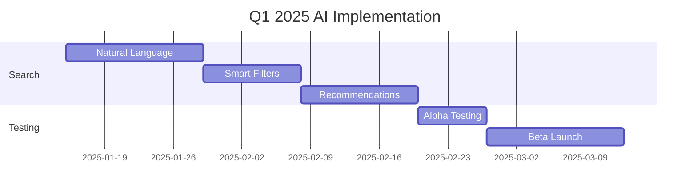
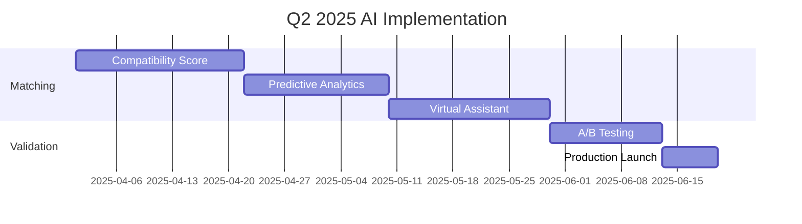

# CastMatch AI Innovation Roadmap
## Intelligent Features Implementation Strategy

### EXECUTIVE SUMMARY
CastMatch will leverage AI to transform talent discovery from a manual, time-intensive process to an intelligent, predictive system that understands nuanced casting requirements and matches them with precision.

---

## Q1 2025: FOUNDATION AI FEATURES

### 1. Natural Language Search
**Launch: Week 4**

#### Implementation
```python
class NaturalLanguageSearch:
    """
    Convert natural queries to structured searches
    Examples:
    - "Young male actor who can dance and speak Hindi"
    - "Female model 20-25 for fashion shoot next week"
    - "Child artist with experience in TV commercials"
    """
    
    def parse_query(self, query: str):
        entities = {
            'role': self.extract_role(query),
            'age': self.extract_age_range(query),
            'gender': self.extract_gender(query),
            'skills': self.extract_skills(query),
            'languages': self.extract_languages(query),
            'availability': self.extract_timeline(query),
            'experience': self.extract_experience(query)
        }
        return self.build_structured_query(entities)
```

#### Features
- Multi-language support (English, Hindi, Hinglish)
- Voice input capability
- Query suggestions and auto-complete
- Contextual understanding
- Typo tolerance

#### Success Metrics
- Query understanding accuracy: >85%
- Search result relevance: >90%
- User adoption rate: >60%

### 2. Smart Filters & Auto-Tagging
**Launch: Week 5**

#### Visual Analysis
```javascript
const visualTagger = {
  analyzeHeadshot: async (image) => {
    return {
      age_appearance: estimateAge(image),
      complexion: detectComplexion(image),
      hair: {
        color: detectHairColor(image),
        style: detectHairStyle(image),
        length: detectHairLength(image)
      },
      facial_features: {
        face_shape: detectFaceShape(image),
        distinctive: findDistinctiveFeatures(image)
      },
      body_type: estimateBodyType(image),
      style: detectFashionStyle(image)
    };
  }
};
```

#### Skill Extraction
```python
def extract_skills_from_portfolio(portfolio):
    """
    Analyze portfolio content to auto-tag skills
    """
    skills = {
        'performance': analyze_videos(portfolio.videos),
        'dance_styles': detect_dance_forms(portfolio.dance_videos),
        'martial_arts': detect_combat_skills(portfolio.action_videos),
        'languages': extract_spoken_languages(portfolio.voice_samples),
        'musical': detect_instruments(portfolio.music_videos),
        'athletic': identify_sports(portfolio.sports_content)
    }
    return generate_skill_tags(skills)
```

### 3. Intelligent Recommendations
**Launch: Week 6**

#### Recommendation Engine
```python
class TalentRecommender:
    def __init__(self):
        self.collaborative_filter = CollaborativeFiltering()
        self.content_filter = ContentBasedFiltering()
        self.hybrid_model = HybridRecommender()
    
    def get_recommendations(self, casting_brief):
        # Analyze historical successful castings
        similar_projects = self.find_similar_projects(casting_brief)
        
        # Get talent profiles that match
        collaborative_matches = self.collaborative_filter.predict(
            similar_projects
        )
        
        # Content-based matching
        content_matches = self.content_filter.match(
            casting_brief.requirements
        )
        
        # Hybrid scoring
        final_recommendations = self.hybrid_model.combine(
            collaborative_matches,
            content_matches,
            weights={'collaborative': 0.4, 'content': 0.6}
        )
        
        return self.rank_by_availability_and_location(
            final_recommendations
        )
```

---

## Q2 2025: ADVANCED MATCHING & ANALYTICS

### 4. AI Talent-Role Compatibility Score
**Launch: Month 4**

#### Scoring Algorithm
```python
class CompatibilityScorer:
    def calculate_match_score(self, talent, role):
        scores = {
            'visual_match': self.compare_appearance(
                talent.photos, 
                role.visual_requirements
            ),  # 0-100
            
            'skill_match': self.evaluate_skills(
                talent.skills,
                role.skill_requirements
            ),  # 0-100
            
            'experience_match': self.assess_experience(
                talent.experience,
                role.experience_needed
            ),  # 0-100
            
            'availability_match': self.check_availability(
                talent.calendar,
                role.schedule
            ),  # 0-100
            
            'location_match': self.calculate_proximity(
                talent.location,
                role.shooting_locations
            ),  # 0-100
            
            'budget_match': self.compare_rates(
                talent.rate_card,
                role.budget
            )  # 0-100
        }
        
        # Weighted average based on role priorities
        weights = role.get_priority_weights()
        final_score = sum(
            scores[key] * weights[key] 
            for key in scores
        ) / sum(weights.values())
        
        return {
            'overall_score': final_score,
            'breakdown': scores,
            'recommendations': self.generate_recommendations(scores)
        }
```

#### Compatibility Factors
```json
{
  "appearance_matching": {
    "face_similarity": "AI face matching with reference",
    "body_type": "Comparison with role requirements",
    "age_appearance": "Visual age vs required age",
    "style_fit": "Fashion sense alignment"
  },
  
  "performance_matching": {
    "acting_range": "Emotional range analysis",
    "dialogue_delivery": "Voice and diction quality",
    "physical_abilities": "Action/dance capabilities",
    "screen_presence": "Confidence and charisma metrics"
  },
  
  "professional_matching": {
    "punctuality_score": "Based on past bookings",
    "professionalism": "Client feedback analysis",
    "adaptability": "Role versatility index",
    "collaboration": "Team player rating"
  }
}
```

### 5. Predictive Analytics Dashboard
**Launch: Month 5**

#### Trend Prediction
```python
class CastingTrendPredictor:
    def predict_upcoming_demands(self):
        # Analyze historical data
        historical_trends = self.analyze_past_castings()
        
        # Industry event correlation
        upcoming_events = self.get_industry_calendar()
        
        # Seasonal patterns
        seasonal_factors = self.identify_seasonal_patterns()
        
        # Social media trends
        social_trends = self.analyze_social_media()
        
        predictions = {
            'role_types': self.predict_role_demand(),
            'skill_requirements': self.predict_skill_trends(),
            'look_preferences': self.predict_appearance_trends(),
            'budget_ranges': self.predict_budget_trends(),
            'timeline': self.generate_timeline()
        }
        
        return predictions
```

#### Success Probability
```javascript
const calculateCastingSuccess = (talent, role, historicalData) => {
  const factors = {
    talentRoleMatch: calculateCompatibility(talent, role),
    talentTrackRecord: analyzePastSuccess(talent.history),
    productionHousePreference: matchWithPreferences(
      talent,
      role.productionHouse.preferences
    ),
    marketTiming: assessMarketConditions(),
    competitionLevel: estimateCompetition(role)
  };
  
  const successProbability = ML.predict(factors, historicalData);
  
  return {
    probability: successProbability,
    confidence: calculateConfidence(factors),
    recommendations: generateActionItems(factors)
  };
};
```

### 6. Virtual Audition AI Assistant
**Launch: Month 6**

#### Real-time Coaching
```python
class VirtualAuditionCoach:
    def provide_real_time_feedback(self, video_stream):
        feedback = {
            'posture': self.analyze_body_language(video_stream),
            'facial_expressions': self.evaluate_emotions(video_stream),
            'voice_modulation': self.analyze_audio(video_stream),
            'eye_contact': self.track_eye_movement(video_stream),
            'energy_level': self.measure_performance_energy(video_stream)
        }
        
        return self.generate_coaching_tips(feedback)
    
    def analyze_performance(self, recorded_audition):
        """Post-audition analysis and improvement suggestions"""
        analysis = {
            'strengths': self.identify_strong_points(recorded_audition),
            'improvements': self.suggest_improvements(recorded_audition),
            'comparison': self.compare_with_successful_auditions(),
            'training_plan': self.create_personalized_training()
        }
        
        return analysis
```

---

## Q3 2025: INTELLIGENCE AUGMENTATION

### 7. AI Casting Director Assistant
**Launch: Month 7**

#### Automated Shortlisting
```python
class AIAssistantDirector:
    def create_shortlist(self, brief, preferences):
        # Initial pool
        candidates = self.search_talent_pool(brief)
        
        # Apply AI filtering
        filtered = self.apply_smart_filters(
            candidates,
            brief.requirements
        )
        
        # Rank by multiple factors
        ranked = self.multi_factor_ranking(
            filtered,
            weights=preferences.ranking_weights
        )
        
        # Diversity consideration
        diverse_list = self.ensure_diversity(
            ranked,
            preferences.diversity_goals
        )
        
        # Generate presentation
        return self.create_presentation(
            diverse_list,
            include_reasoning=True
        )
```

#### Script-to-Cast Matching
```javascript
const scriptAnalyzer = {
  analyzeScript: async (scriptFile) => {
    const characters = await extractCharacters(scriptFile);
    
    return characters.map(character => ({
      name: character.name,
      description: character.description,
      personality: analyzePersonality(character.dialogues),
      screenTime: calculateScreenTime(character),
      importance: determineImportance(character),
      relationships: mapRelationships(character, characters),
      suggestedTalent: findMatchingTalent(character)
    }));
  }
};
```

### 8. Performance Prediction Model
**Launch: Month 8**

#### Box Office Prediction
```python
def predict_casting_impact(cast_list, movie_details):
    """
    Predict box office/TRP impact based on casting choices
    """
    factors = {
        'star_power': calculate_combined_star_power(cast_list),
        'chemistry': predict_on_screen_chemistry(cast_list),
        'genre_fit': assess_genre_alignment(cast_list, movie_details),
        'audience_appeal': estimate_target_audience_appeal(cast_list),
        'social_reach': calculate_social_media_reach(cast_list)
    }
    
    prediction = ML_MODEL.predict(factors)
    
    return {
        'predicted_performance': prediction,
        'confidence_interval': calculate_confidence(prediction),
        'risk_factors': identify_risks(cast_list),
        'optimization_suggestions': suggest_improvements(cast_list)
    }
```

### 9. Blockchain Verified Portfolios
**Launch: Month 9**

#### Verification System
```solidity
contract TalentVerification {
    struct Credential {
        string credentialType;
        string issuer;
        uint256 issuedDate;
        string proofHash;
        bool verified;
    }
    
    struct TalentProfile {
        address talentAddress;
        string profileHash;
        Credential[] credentials;
        uint256 verificationLevel;
        mapping(address => bool) endorsements;
    }
    
    function verifyCredential(
        address talent,
        string memory credentialType,
        string memory proof
    ) public {
        // Verification logic
        require(isAuthorizedVerifier(msg.sender));
        // Add verified credential to talent profile
    }
}
```

---

## Q4 2025: FUTURE INNOVATIONS

### 10. Deepfake Detection
**Launch: Month 10**

```python
class DeepfakeDetector:
    def verify_authenticity(self, media_file):
        """
        Ensure portfolio media is authentic
        """
        checks = {
            'facial_consistency': self.check_facial_artifacts(media_file),
            'temporal_coherence': self.analyze_frame_consistency(media_file),
            'audio_sync': self.verify_audio_visual_sync(media_file),
            'metadata': self.validate_metadata(media_file),
            'blockchain_proof': self.verify_blockchain_signature(media_file)
        }
        
        authenticity_score = self.calculate_authenticity(checks)
        
        return {
            'is_authentic': authenticity_score > 0.95,
            'confidence': authenticity_score,
            'detailed_analysis': checks
        }
```

### 11. AR/VR Auditions
**Launch: Month 11**

```javascript
const vrAuditionStudio = {
  setupVirtualSet: (sceneRequirements) => {
    return {
      environment: generate3DEnvironment(sceneRequirements),
      lighting: setupVirtualLighting(sceneRequirements),
      props: loadVirtualProps(sceneRequirements),
      camera: setupVirtualCameras()
    };
  },
  
  conductAudition: async (talent, scene) => {
    const session = await createVRSession();
    const performance = await recordPerformance(talent, scene);
    const analysis = await analyzeVRPerformance(performance);
    
    return {
      recording: performance,
      metrics: analysis,
      shareableLink: generateShareableVR(performance)
    };
  }
};
```

### 12. Emotion AI
**Launch: Month 12**

```python
class EmotionAnalyzer:
    def analyze_emotional_range(self, audition_video):
        """
        Deep analysis of actor's emotional capabilities
        """
        emotions_detected = []
        
        for frame in video_frames(audition_video):
            emotions = {
                'facial': self.detect_facial_emotions(frame),
                'body': self.analyze_body_language(frame),
                'voice': self.analyze_voice_emotions(frame.audio),
                'micro_expressions': self.detect_micro_expressions(frame)
            }
            emotions_detected.append(emotions)
        
        return {
            'emotional_range': calculate_range(emotions_detected),
            'authenticity': measure_emotional_authenticity(emotions_detected),
            'transitions': analyze_emotional_transitions(emotions_detected),
            'intensity': measure_emotional_intensity(emotions_detected),
            'recommendations': suggest_emotional_training(emotions_detected)
        }
```

---

## IMPLEMENTATION TIMELINE

### Phase 1: Foundation (Q1 2025)


### Phase 2: Advanced (Q2 2025)


---

## SUCCESS METRICS

### Accuracy Targets
```yaml
natural_language_search:
  understanding: 85%
  relevance: 90%
  
talent_matching:
  precision: 85%
  recall: 80%
  f1_score: 0.825
  
prediction_models:
  trend_accuracy: 75%
  success_probability: 70%
  
verification:
  deepfake_detection: 99%
  credential_validation: 100%
```

### Business Impact
```json
{
  "efficiency_gains": {
    "search_time_reduction": "60%",
    "shortlisting_time": "70% faster",
    "casting_cycle": "40% shorter"
  },
  
  "quality_improvements": {
    "talent_role_fit": "35% better",
    "client_satisfaction": "25% increase",
    "successful_castings": "30% increase"
  },
  
  "revenue_impact": {
    "premium_adoption": "50% of users",
    "api_monetization": "₹20L/month",
    "efficiency_savings": "₹50L/month"
  }
}
```

---

## RISK MITIGATION

### Technical Risks
- Model bias: Regular audits and diverse training data
- Performance: Edge computing and model optimization
- Privacy: Federated learning and data encryption

### Ethical Considerations
- Transparency: Explainable AI for all decisions
- Fairness: Bias detection and correction
- Consent: Clear opt-in for AI features
- Human oversight: Manual override capabilities

### Contingency Plans
- Fallback to rule-based systems
- Gradual rollout with kill switches
- Human-in-the-loop for critical decisions
- Regular model retraining schedule