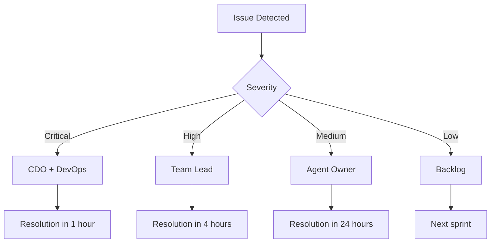

# Agent Resource Allocation & Coordination Matrix
## 11-Agent Team Strategic Deployment

### AGENT ROSTER & CORE COMPETENCIES

#### 1. Chief Design Officer (CDO)
**Role:** Strategic Vision & Quality Authority
```json
{
  "responsibilities": [
    "Design vision and strategy",
    "Quality gates enforcement", 
    "Stakeholder alignment",
    "Resource allocation",
    "Final design approval"
  ],
  "deliverables": [
    "Quarterly OKRs",
    "Design principles",
    "Quality standards",
    "Performance metrics"
  ],
  "decision_authority": "FINAL",
  "reports_to": "CEO/Board"
}
```

#### 2. Design Research Analyst
**Role:** Data-Driven Insights & User Research
```json
{
  "responsibilities": [
    "User research coordination",
    "Competitive analysis",
    "Trend identification",
    "A/B testing design",
    "Persona development"
  ],
  "deliverables": [
    "Weekly trend reports",
    "User journey maps",
    "Research documentation",
    "Testing protocols"
  ],
  "tools": ["Mixpanel", "Hotjar", "Maze", "UserTesting"],
  "reports_to": "CDO"
}
```

#### 3. UI/UX Designer Agent
**Role:** Design System Implementation
```json
{
  "responsibilities": [
    "Component design",
    "Interaction patterns",
    "Visual design",
    "Prototype creation",
    "Design documentation"
  ],
  "deliverables": [
    "Figma components",
    "Style guide",
    "Interaction specs",
    "Design handoff"
  ],
  "tools": ["Figma", "Principle", "Framer"],
  "reports_to": "CDO"
}
```

#### 4. Frontend UI Monitor Agent
**Role:** Design Implementation Quality
```json
{
  "responsibilities": [
    "Component development",
    "Design-dev parity",
    "Performance optimization",
    "Accessibility implementation",
    "Cross-browser testing"
  ],
  "deliverables": [
    "React components",
    "Storybook documentation",
    "Performance reports",
    "Accessibility audits"
  ],
  "tech_stack": ["React", "TypeScript", "Tailwind", "Storybook"],
  "reports_to": "UI/UX Designer"
}
```

#### 5. Design QA Specialist Agent
**Role:** Quality Assurance & Compliance
```json
{
  "responsibilities": [
    "Visual regression testing",
    "Accessibility compliance",
    "Brand consistency",
    "Device testing",
    "User acceptance testing"
  ],
  "deliverables": [
    "QA reports",
    "Bug documentation",
    "Compliance certificates",
    "Testing matrices"
  ],
  "tools": ["Percy", "Chromatic", "BrowserStack", "Axe"],
  "reports_to": "CDO"
}
```

#### 6. Backend API Monitor Agent
**Role:** API Design & Performance
```json
{
  "responsibilities": [
    "API architecture",
    "Data modeling",
    "Performance optimization",
    "Security implementation",
    "Documentation"
  ],
  "deliverables": [
    "API specifications",
    "Database schemas",
    "Performance benchmarks",
    "Security audits"
  ],
  "tech_stack": ["Node.js", "PostgreSQL", "Redis", "GraphQL"],
  "reports_to": "DevOps Lead"
}
```

#### 7. AI/ML Monitor Agent
**Role:** Intelligence Layer Development
```json
{
  "responsibilities": [
    "ML model development",
    "Algorithm optimization",
    "Data pipeline design",
    "Model training",
    "Performance monitoring"
  ],
  "deliverables": [
    "Talent matching algorithm",
    "Search optimization",
    "Recommendation engine",
    "Performance metrics"
  ],
  "tech_stack": ["Python", "TensorFlow", "Scikit-learn", "OpenAI"],
  "reports_to": "CTO"
}
```

#### 8. DevOps Infrastructure Agent
**Role:** Infrastructure & Deployment
```json
{
  "responsibilities": [
    "CI/CD pipelines",
    "Cloud infrastructure",
    "Monitoring setup",
    "Security hardening",
    "Disaster recovery"
  ],
  "deliverables": [
    "Deployment pipelines",
    "Infrastructure as Code",
    "Monitoring dashboards",
    "Backup strategies"
  ],
  "tech_stack": ["AWS", "Docker", "Kubernetes", "Terraform"],
  "reports_to": "CTO"
}
```

#### 9. Testing QA Monitor Agent
**Role:** Comprehensive Testing Strategy
```json
{
  "responsibilities": [
    "Test strategy design",
    "Automated testing",
    "Performance testing",
    "Security testing",
    "Test reporting"
  ],
  "deliverables": [
    "Test plans",
    "Automation scripts",
    "Coverage reports",
    "Bug reports"
  ],
  "tools": ["Jest", "Cypress", "JMeter", "Selenium"],
  "reports_to": "QA Lead"
}
```

#### 10. Integration Workflow Agent
**Role:** Third-party Integrations
```json
{
  "responsibilities": [
    "WhatsApp integration",
    "Payment gateway setup",
    "Calendar sync",
    "Email services",
    "Analytics integration"
  ],
  "deliverables": [
    "Integration documentation",
    "API connectors",
    "Webhook handlers",
    "Error handling"
  ],
  "integrations": ["WhatsApp Business", "Razorpay", "Google Calendar", "SendGrid"],
  "reports_to": "Backend Lead"
}
```

#### 11. Mumbai Market Specialist Agent
**Role:** Local Market Optimization
```json
{
  "responsibilities": [
    "Cultural adaptation",
    "Language localization",
    "Market research",
    "Partnership development",
    "Regional compliance"
  ],
  "deliverables": [
    "Localization guidelines",
    "Partnership proposals",
    "Market reports",
    "Compliance documentation"
  ],
  "expertise": ["Bollywood ecosystem", "Regional languages", "Local regulations"],
  "reports_to": "CDO"
}
```

---

## PHASE-BASED AGENT DEPLOYMENT

### Phase 1: Foundation (Week 1-2)

#### Primary Team
```yaml
lead: CDO
core_team:
  - UI/UX Designer: Design system creation
  - Frontend UI Monitor: Component development
  - Design Research Analyst: User research
  
support_team:
  - DevOps: Environment setup
  - Backend API: Database design
  
deliverables:
  week_1:
    - Token system complete
    - 15 core components
    - Research findings
  week_2:
    - 30 components total
    - Mobile optimization
    - Performance baseline
```

### Phase 2: Core Features (Week 3-4)

#### Primary Team
```yaml
lead: UI/UX Designer
core_team:
  - Frontend UI Monitor: Feature implementation
  - Backend API Monitor: API development
  - Integration Workflow: WhatsApp setup
  - Mumbai Market Specialist: Localization
  
support_team:
  - Testing QA: Test automation
  - Design QA: Visual testing
  
deliverables:
  week_3:
    - Talent discovery system
    - Profile builder
    - Search interface
  week_4:
    - Messaging system
    - Audition management
    - Payment integration
```

### Phase 3: Advanced Features (Week 5-6)

#### Primary Team
```yaml
lead: AI/ML Monitor
core_team:
  - Backend API Monitor: ML infrastructure
  - Frontend UI Monitor: AI interface
  - Integration Workflow: External APIs
  
support_team:
  - DevOps: Scaling preparation
  - Testing QA: Load testing
  
deliverables:
  week_5:
    - AI matching engine
    - Virtual studio beta
    - Smart search
  week_6:
    - Analytics dashboard
    - Collaboration tools
    - Blockchain integration
```

### Phase 4: Optimization & Launch (Week 7-8)

#### All-Hands Deployment
```yaml
lead: DevOps Infrastructure
core_team:
  ALL_AGENTS: "Full team activation"
  
focus_areas:
  CDO: Final approvals
  Design QA: Comprehensive testing
  Testing QA: Stress testing
  DevOps: Production deployment
  Backend API: Performance tuning
  AI/ML: Model optimization
  Mumbai Specialist: Launch partnerships
  
deliverables:
  week_7:
    - Performance optimization
    - Security hardening
    - Final testing
  week_8:
    - Production deployment
    - Monitoring setup
    - Launch support
```

---

## COLLABORATION PROTOCOLS

### Daily Sync Structure
```json
{
  "standup": {
    "time": "9:00 AM IST",
    "duration": "15 minutes",
    "format": "Round-robin updates",
    "participants": "Active phase agents"
  },
  "design_review": {
    "time": "2:00 PM IST",
    "duration": "30 minutes",
    "format": "Screen share + critique",
    "participants": "Design team"
  },
  "tech_sync": {
    "time": "5:00 PM IST",
    "duration": "15 minutes",
    "format": "Blocker resolution",
    "participants": "Tech team"
  }
}
```

### Communication Channels
```yaml
channels:
  urgent:
    tool: Slack
    response_time: <15 minutes
    use_cases: [blockers, outages, critical_bugs]
  
  collaboration:
    tool: Figma/GitHub
    response_time: <2 hours
    use_cases: [design_feedback, code_review, documentation]
  
  reporting:
    tool: Notion
    response_time: <24 hours
    use_cases: [status_updates, metrics, documentation]
```

### Handoff Protocols

#### Design to Development
```json
{
  "requirements": {
    "figma_specs": "Complete with annotations",
    "assets": "Exported in required formats",
    "tokens": "Updated in design system",
    "acceptance_criteria": "Documented in ticket"
  },
  "timeline": "48 hours for review and questions",
  "approval": "Design QA sign-off required"
}
```

#### Development to QA
```json
{
  "requirements": {
    "feature_complete": "All acceptance criteria met",
    "unit_tests": "90% coverage",
    "documentation": "API docs and README",
    "deployment": "Staging environment"
  },
  "timeline": "24 hours for initial testing",
  "approval": "Testing QA sign-off required"
}
```

---

## QUALITY GATES & CHECKPOINTS

### Phase Transition Criteria

#### Foundation → Core Features
- [ ] Design system 100% complete
- [ ] Component library documented
- [ ] Performance baseline established
- [ ] User research validated
- [ ] Infrastructure operational

#### Core Features → Advanced
- [ ] Core features user-tested
- [ ] API performance <200ms
- [ ] Mobile experience optimized
- [ ] Security audit passed
- [ ] Integration points verified

#### Advanced → Launch
- [ ] AI accuracy >90%
- [ ] Load testing passed (10K users)
- [ ] All features integrated
- [ ] Documentation complete
- [ ] Launch plan approved

### Agent Performance Metrics

```json
{
  "velocity_metrics": {
    "CDO": "Decisions per week",
    "Designer": "Components delivered",
    "Frontend": "Features completed",
    "Backend": "APIs delivered",
    "QA": "Bugs found/fixed",
    "DevOps": "Deployment success rate",
    "AI/ML": "Model accuracy"
  },
  "quality_metrics": {
    "design_consistency": ">95%",
    "code_coverage": ">90%",
    "bug_escape_rate": "<5%",
    "performance_SLA": "99.9%",
    "user_satisfaction": ">4.5/5"
  }
}
```

---

## RISK MITIGATION & CONTINGENCY

### Agent Availability Matrix
```yaml
primary_agents:
  CDO: 
    backup: Design Research Analyst
    handoff_time: 2 hours
  
  UI_Designer:
    backup: Frontend UI Monitor
    handoff_time: 4 hours
  
  Backend_API:
    backup: DevOps Infrastructure
    handoff_time: 2 hours
  
  AI_ML:
    backup: Backend API Monitor
    handoff_time: 6 hours
```

### Escalation Framework


### Contingency Plans

#### Design Delays
- Pre-approved component variations
- Design debt tracking
- Progressive enhancement approach

#### Technical Issues
- Feature flags for quick rollback
- Canary deployments
- Hot-fix protocol

#### Resource Constraints
- Prioritized feature list
- MVP definitions
- Outsourcing options ready