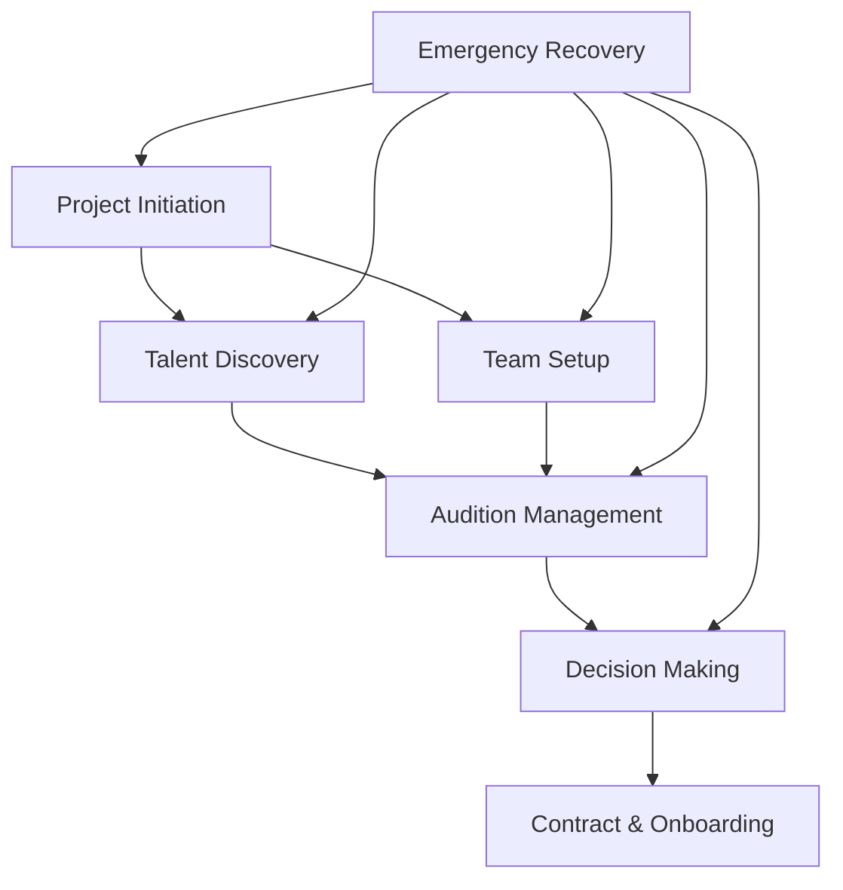

# CastMatch AI User Flows Documentation

## Overview
Comprehensive user flows for CastMatch AI's conversational casting platform, designed specifically for Mumbai's OTT and film production industry. These flows follow an 80% conversation, 20% traditional UI paradigm.

## Flow Architecture

### 🎬 Core User Flows

#### 1. [Project Initiation Flow](./project-initiation/documentation/project-initiation-flow.md)
**Starting Point:** "I need to cast a new show"
- **Duration:** 5-6 minutes
- **Key Phases:** Project setup → Role definition → Team configuration → Budget setting
- **Success Metric:** Complete setup in <5 minutes
- **Context Created:** Project object with all parameters for downstream flows

#### 2. [Talent Discovery Flow](./talent-discovery/documentation/talent-discovery-flow.md)
**Starting Point:** "Find me a male lead, 25-35 years"
- **Duration:** 3-5 minutes
- **Key Phases:** Search → Filter → Explore → Compare → Shortlist
- **Success Metric:** Find suitable talent in <5 minutes
- **Context Used:** Project requirements, budget, timeline

#### 3. [Audition Management Flow](./audition-management/documentation/audition-management-flow.md)
**Starting Point:** "Schedule auditions for shortlisted actors"
- **Duration:** Full day process
- **Key Phases:** Planning → Scheduling → Day-of management → Feedback → Review
- **Success Metric:** 90% schedule adherence, 100% feedback capture
- **Context Bridge:** Talent profiles → Audition results

#### 4. [Decision Making Flow](./decision-making/documentation/decision-making-flow.md)
**Starting Point:** "Let's finalize the cast"
- **Duration:** 8-10 minutes per role
- **Key Phases:** Comparison → Stakeholder alignment → Negotiation → Approval → Communication
- **Success Metric:** Decision consensus in <24 hours
- **Context Culmination:** All previous context leads to decision

#### 5. [Emergency Recovery Flow](./emergency-recovery/documentation/emergency-recovery-flow.md)
**Starting Point:** User distress signals or "Help!"
- **Duration:** <1 minute to resolution path
- **Key Phases:** Problem detection → Rapid assessment → Solution presentation → Recovery
- **Success Metric:** Resolution in <5 minutes
- **Context Preservation:** Maintains state through crisis

## 🧭 Navigation Paradigm

### Conversational Navigation (80%)
- Natural language commands
- Voice-first interaction
- AI-guided progression
- Context-aware suggestions
- Proactive assistance

### Traditional UI Elements (20%)
- Quick action buttons
- Visual confirmations
- Swipe gestures
- Emergency controls
- Settings access

## 🧠 Context Flow Map

```
[User Context]
    ↓
[Project Initiation] → Creates project context
    ↓
[Talent Discovery] → Uses project context, creates search context
    ↓
[Audition Management] → Uses talent context, creates performance context
    ↓
[Decision Making] → Synthesizes all context, creates decision context
    ↓
[Project Completion]

[Emergency Recovery] ← Preserves and restores any context state
```

## 📊 Information Hierarchy Alignment

### Priority 1 (Immediate Access)
- Active conversations
- Today's tasks
- Urgent decisions
- Current project status

### Priority 2 (Frequent Access)
- Talent search
- Schedule management
- Team collaboration
- Budget tracking

### Priority 3 (Reference)
- Historical data
- Templates
- Reports
- Industry resources

## 🎯 Success Metrics Summary

| Flow | Time Target | Success Rate | User Satisfaction |
|------|------------|--------------|-------------------|
| Project Initiation | <5 minutes | >95% completion | >4.5/5 |
| Talent Discovery | <5 minutes | >90% relevance | >4.5/5 |
| Audition Management | Real-time | >90% adherence | >4.5/5 |
| Decision Making | <24 hours | >85% consensus | >4.0/5 |
| Emergency Recovery | <5 minutes | >95% resolution | >4.5/5 |

## 🏗️ Wireframe Requirements

### Mobile-First Design (320px)
- Full-screen conversation interface
- Voice input prominent
- Swipe gestures enabled
- Bottom navigation
- Thumb-friendly zones

### Tablet Adaptation (768px)
- Split-view capabilities
- Side panels for context
- Drag-and-drop support
- Multi-column layouts

### Desktop Enhancement (1440px)
- Multi-window workflows
- Keyboard shortcuts
- Advanced filtering
- Bulk operations

## 🗣️ Conversation Design Principles

### AI Personality
- **Professional yet friendly:** Industry expert who's approachable
- **Culturally aware:** Understands Mumbai context, festivals, traffic
- **Proactive:** Anticipates needs, suggests next steps
- **Efficient:** Respects time pressure, provides quick paths

### Response Patterns
- **Acknowledgment:** <200ms response to show listening
- **Processing:** Visual/audio feedback during thinking
- **Clarity:** Simple language, avoid jargon
- **Options:** Maximum 3-4 choices at a time

## 🚨 Error Handling Strategy

### Prevention
- Smart defaults
- Validation before action
- Confirmation for critical actions
- Auto-save everything

### Recovery
- Immediate undo options
- State preservation
- Multiple recovery paths
- Human fallback available

## 🏙️ Mumbai-Specific Adaptations

### Cultural Considerations
- Festival calendar integration
- Hierarchical respect in communications
- Relationship network awareness
- Regional language support

### Practical Considerations
- Traffic pattern awareness
- Weather impact planning
- Studio location intelligence
- Local talent pool priority

## 📱 Implementation Priorities

### Phase 1: Core Flows
1. Project Initiation
2. Talent Discovery
3. Basic Audition Scheduling

### Phase 2: Advanced Features
1. Full Audition Management
2. Decision Making Workflows
3. Team Collaboration

### Phase 3: Intelligence Layer
1. AI Learning & Recommendations
2. Predictive Assistance
3. Emergency Recovery
4. Advanced Analytics

## 🔗 Flow Dependencies



## 📂 File Structure

```
user-flows/
├── README.md (this file)
├── project-initiation/
│   ├── documentation/
│   ├── conversation-scripts/
│   ├── decision-trees/
│   ├── wireframe-requirements/
│   └── context-mapping/
├── talent-discovery/
│   └── [same structure]
├── audition-management/
│   └── [same structure]
├── decision-making/
│   └── [same structure]
└── emergency-recovery/
    └── [same structure]
```

## 🚀 Next Steps for Wireframe Designers

1. **Start with Project Initiation Flow**
   - Design conversation interface
   - Create quick selection components
   - Build progress indicators

2. **Implement Voice Input Patterns**
   - Voice button states
   - Recording feedback
   - Transcription display

3. **Design State Transitions**
   - Loading states
   - Success confirmations
   - Error displays
   - Recovery screens

4. **Create Component Library**
   - Talent cards
   - Schedule blocks
   - Decision matrices
   - Chat bubbles

5. **Test with Real Scenarios**
   - Use provided conversation scripts
   - Follow decision trees
   - Validate context flow

## 📞 Contact & Support

For questions about these user flows:
- Review conversation scripts in each flow directory
- Check decision trees for logic branches
- Refer to context mapping for data flow
- Consult wireframe requirements for UI specifications

These flows are living documents designed to evolve with user feedback and platform capabilities.